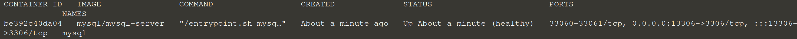

 

#### 1. Setup your Wordpress 

Docker Compose is based on a docker-compose.yml file. This file defines all of the containers and settings you need to launch your set of clusters.

<pre class="file" data-filename="./docker-compose.yml" data-target="replace">

version: '3.2' 

services: 
    mysql-server: 
        container_name: mysql 
        ports: 
            - "13306:3306"
        environment: 
            MYSQL_ROOT_PASSWORD: 12345 
        image: mysql/mysql-server

</pre>

#### 2. Start the WordPress and MySql container in background

Run `cd tutorial`{{execute}}
 

Run `docker-compose up -d`{{execute}}

#### 3. Check if both container is running

Run `docker ps`{{execute}}
 

#### 4. Check the logs of the mysql container to make sure there is no errors

Run `docker logs mysql`{{execute}}

#### 5. Access your mysql in terminal

Run `docker exec -it mysql bash`{{execute}}
 

You should be connected to the container.

