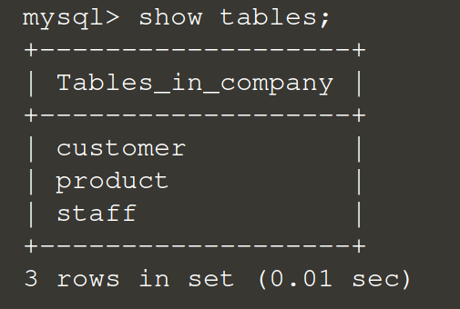

### Login to the mysql database

After enter to the container, then we can login to the mysql database.
 
Let's try with root account.

Run `mysql -u root -p`{{execute}}
 
The password is `12345`{{execute}}

### Create new database

To simulate a company database, let's start with creating a new database called 'company'.

Run `create database company;`{{execute}}

And then use 'use' command to enter the new database:

Run `use company;`{{execute}}

### Create tables

In a company database there should be some important items such as customer and product.
 
Let's create those tables by following commands:

Run `CREATE TABLE customer(name VARCHAR(15), gender VARCHAR(3), id int, phone varchar(8));`{{execute}}
Run `CREATE TABLE product(name VARCHAR(30), price int, stocks int, num int);`{{execute}}
Run `CREATE TABLE staff(name VARCHAR(15), id int, department VARCHAR(10), age int);`{{execute}}

### Check the tables 

Run `SHOW TABLES;`{{execute}}

