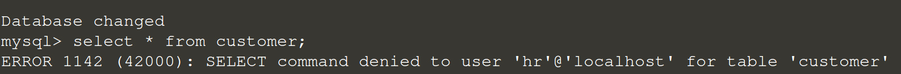

### Testing

Try to login with another account:

`quit`{{execute}}

Try to login as sales:

`mysql -usales -p`{{execute}}

Password `sales`{{execute}}

Show available tables:

`USE company;`{{execute}}

Run `SHOW TABLES;`{{execute}}

Try to insert a new customer and test:

`insert into customer (name, gender, id, phone) value ('Ricky', 'M', 1, 12345678);`{{execute}}

Then run:

`select * from customer;`{{execute}}

You should able to see a customer record.

Try to login with hr account:

`quit`{{execute}}

`mysql -uhr -p`{{execute}}

Password `hr`{{execute}}

`USE company;`{{execute}}

And then run:

`select * from customer;`{{execute}}

The query should be denied.

