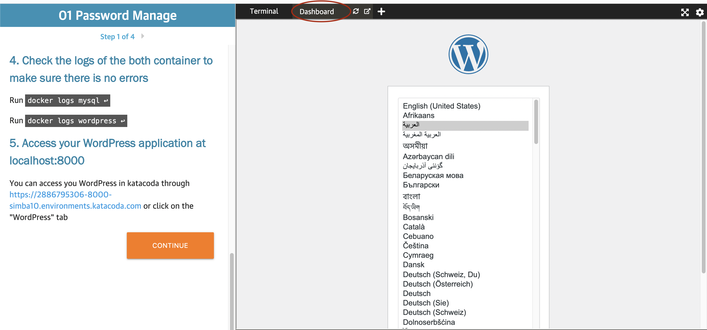
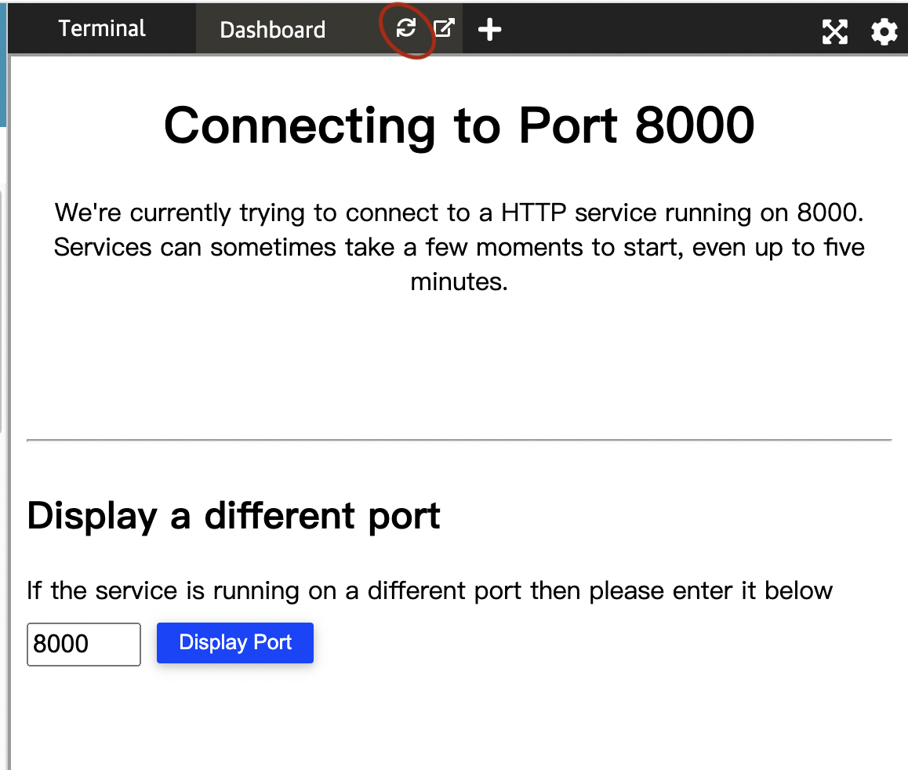

## 1. Access your Wordpress
---

### The WordPress is created automatically and you need to wait around 1-2 minutes for the WordPress creation.
<br></br>
## Access the wordpress:

### You can access your WordPress website through the link:
```sh 
https://[[HOST_SUBDOMAIN]]-8000-[[KATACODA_HOST]].environments.katacoda.com 
```
### Or click Dashboard tap on the right side of katacoda like the following image:

<br></br>

### If an error exists mean the WordPress is not completely setup yet, you need wait around 30 second and click the refresh button near the Dashboard tap to refresh the Dashboard:


