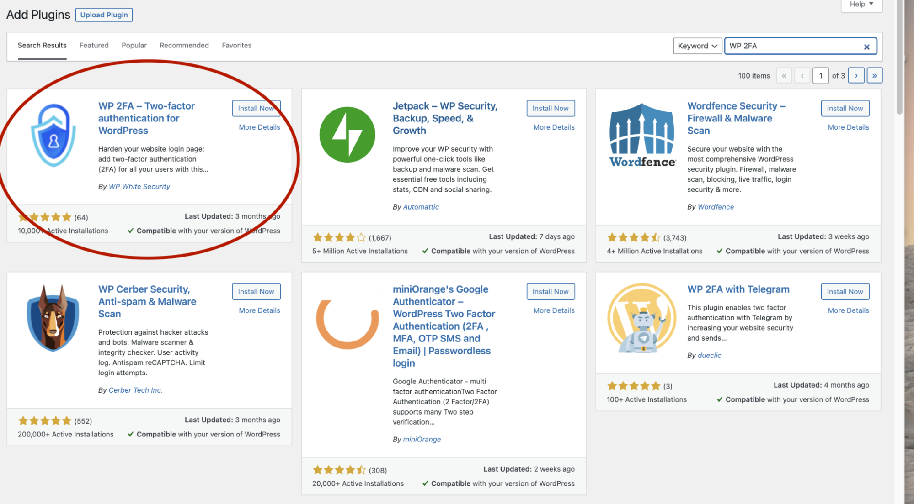

## **Step 1:** 
Click the plugins in the menu bar and click the ```Add New button``` to add a new plugin for the WordPress.


## **Step 2:**
Input the ```WP 2FA ```in the search bar and the WP 2FA plug will appear


