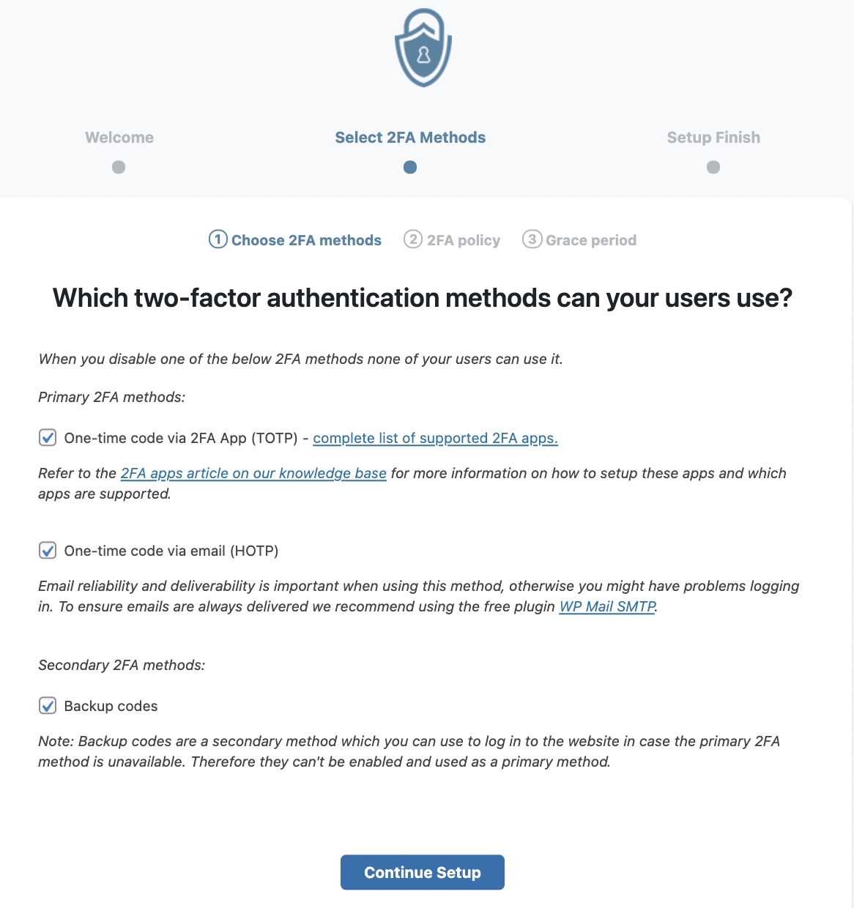
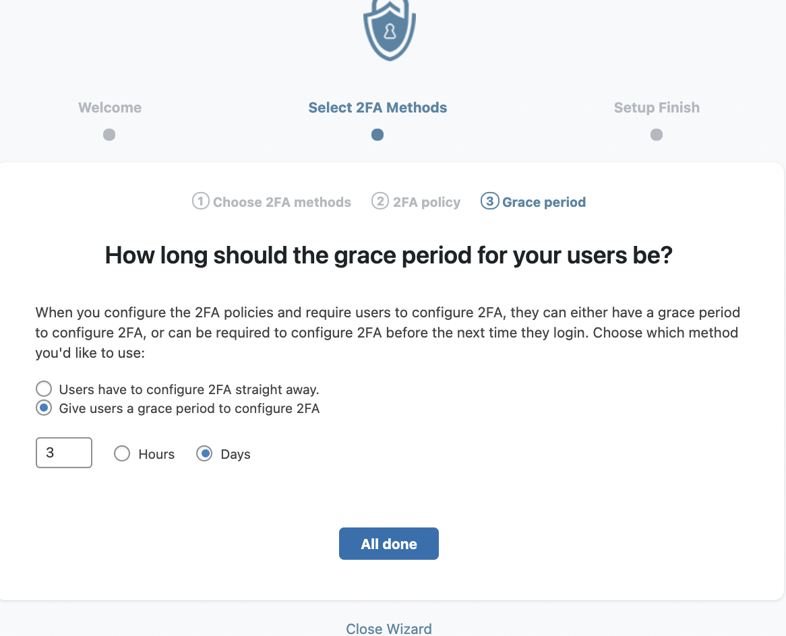
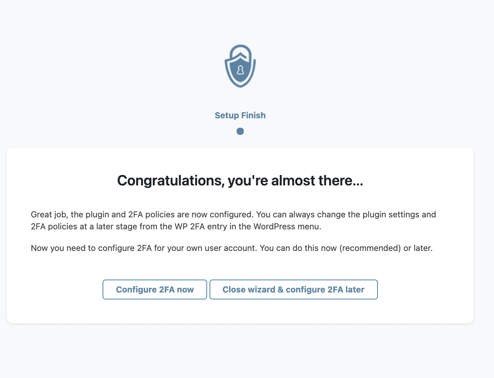

### **4. Setup the WP 2FA Plugins**
---
### **Step 1:**

After activating the WP 2FA plugin, you will be brought to the setup page of the WP 2FA Plugins.To start the setup, you need to click the `Let’s get started` button to start setup.

### **Step2:**

select the 2FA method(suggested to select all) and click the `Continue Setup` button.

 

### **Step3:**

 Select the target user to enforce 2FA and click `continue Setup` button.

### **Step4:**
 Setup a grace period for user and click `All done` to finish the setup

### **Step5:**
The setup of the WP 2FA plugin is complete, you need to click `configure 2FA now` to configure the WP 2FA Plugin.

