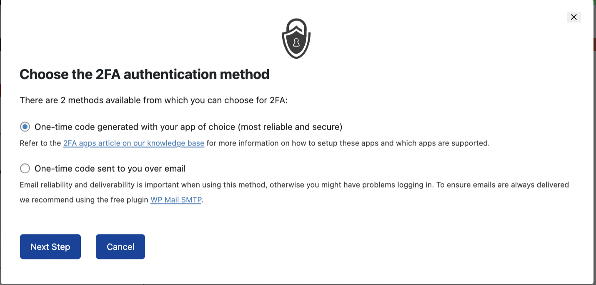
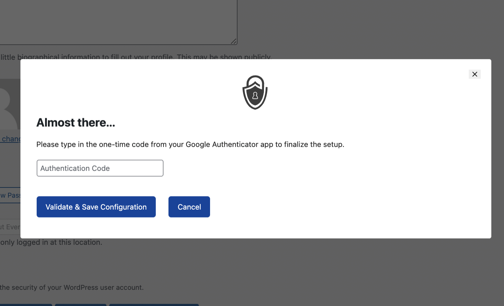
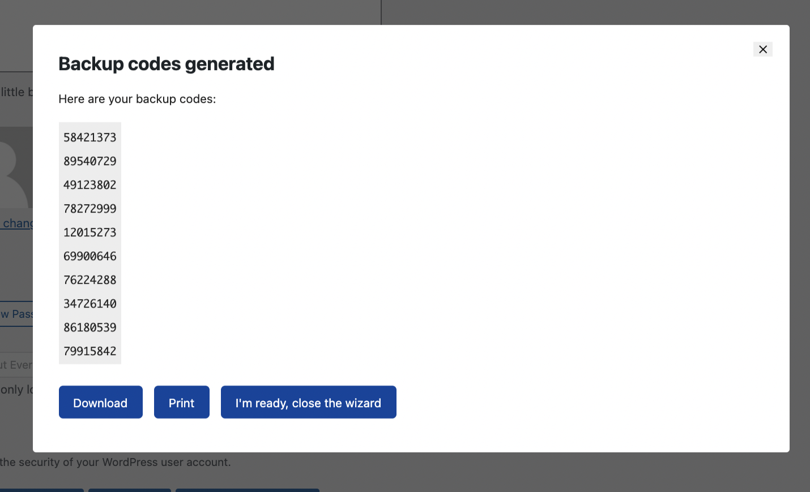

## **4. Configure the WP 2FA Plugin**
---
## **Step 1:**
Select the 2FA authentication method(Suggested to choose generated with app) and click the ```Next Step``` button.


<br></br>
## **Step 2:**
After Select the 2FA authentication method, a QR code will show up


<br></br>
## **Step 3:**
To set up the 2FA method you need to download the Google Authenticator extension or application using the following Link:

### *Extension Version:*
`https://chrome.google.com/webstore/detail/authenticator/bhghoamapcdpbohphigoooaddinpkbai?hl=zh-TW`{{copy}}

### *APK Version:*
`https://play.google.com/store/apps/details?id=com.google.android.apps.authenticator2&hl=zh_HK&gl=US`{{copy}}

### *IOS Version*
`https://apps.apple.com/us/app/google-authenticator/id388497605`{{copy}}
<br></br>
## **Step 4:**
After you download the Google Authenticator extension, you need to open it and use the application or extension to scan the aforementioned QR code and
after scanning the QR code a 6-digital number will show up which will use for finalizing the configuration and use to login in the future. Once you generate the 6-digital number successfully, you can click the `I'm Ready` button.


<br></br>
## **Step 5:**
Input the 6-digital number to the input field and click `Validation & Save Configuration` button.


<br></br>
## **Step 6:**
After that, Backup codes will be generated. As the backup codes are very important which can help you to find your account back when you cannot log in due to some accident. It is suggested to download the Backup codes and Print the backup codes and keep them in some safe place. After downloading and printing the backup code you can click`I'm ready, close the wizard` button to leave finish the configuration.


<br></br>
## **Modify The configuration** 
You can view the configuration and modify the configuration by clicking the `WP 2FA` on the left bar of the WordPress website

