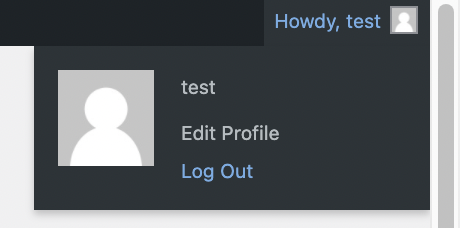
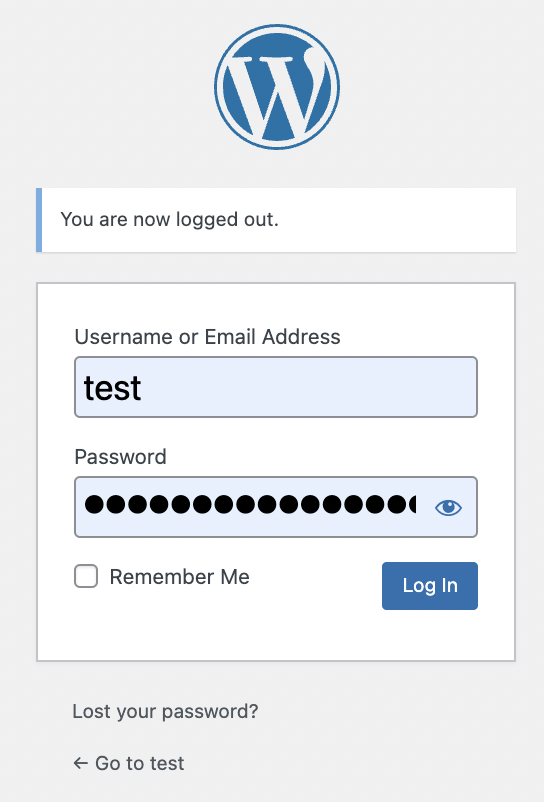
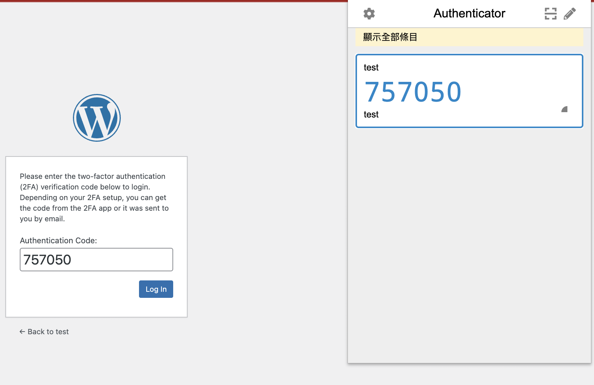

## **4. Checking Plugin**
---

## **Step 1:**
To check whether the plugin are working you need to first log out from wordpress by clicking the `Log Out` button.

## **Step 2:**
Then you need to log in using the username and password as regular.

## **Step 3:**
After logging in using username and password. If the website requires you to input the Authentication Code to log in means that the WP 2FA plugin is working and what you need to do is copy the 6-digital number from Google Authentication and paste it on the input field and click the `Log In` button to log in to the account.

