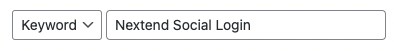
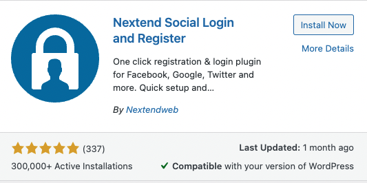
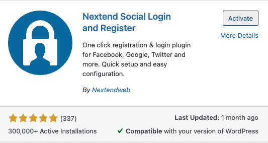

### 3. Setup your the the Nextend Social plugin
---
### **Step 1:** 
After login to wordpress, you can click the plugins in the menu bar and click the `Add New button` to add a new plugin for the WordPress.

  
### **Step 2:**
Input the `Nextend Social Login`{{copy}}in the search bar and Se Login plugin will appear

  

### **Step 3:**
Click `Install Now `button to install the plugin and after installing the `Activate` button will show up and click it to activate the plugin. After activate the plugin.

