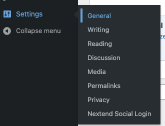

### 4. Setup the Google OAuth
---
The Nextend Social Login plugin allows you to use different OAuth such as Google, Facebook, Apple and GitHub .etc. This course will mainly teach you how to set up the Google OAuth
  

### **step 1:**
After activating the Nextend Social Login plugin, you need to click the Nextend Social Login button which will show up when you hover the setting button.

  

### **step 2:**
widgetFind the Google widget which looks like the following image and clicks the `Getting Start` Button to start to Configure

  

### **step 3:**
Access the following link:
https://console.developers.google.com/apis/
  

### **step 4:**
After accessing the link lease login to your Google account. If you do not have a google account please sign up. After login please click the `Credentials` button in the left navigation bar of the website

  

### **step 5:**
Click the `CREATE CREDENTIALS` button and click the `OAuth client ID` button

  

### **step 6:**
Select the `Web application` in the `Application type`

  

### **step 7:**
Click `ADD URL` button in the `Authorised redirect URIs`

  

### **step 8:**
Go to back to your wordpress website and copy the link in step 17.

  

### **step 9:**
Go back to Google and Paste the link to the `URIs` input field of the Authorised redirect URIs and click the `CREATE` button.

  

### **step 10:**
Go back to Google and Paste the link to the `URIs` input field of the Authorised redirect URIs and click the `CREATE` button and the Client ID and Client Secret will generate.

  

### **step 11:**
After generate you need to go back to wordpress and click the `i am done setting up my Google App` button.

  

### **step 12:**
Copy the Client ID and Client Secret from the google and place it to the Client ID field and Client Secret in WordPress like the following image and click the `Save Changes` button.

  

### **step 13:**
Click the Verify Setting and login with your own google account

  

### **step 14:**
If It show Works Fine please mean the OAuth is set up successfully and please click `Enable` Button to enable

  

### **step 15:**
please click the `General` button in the `Settings` and tick the box in the Membership to allows anyone can register and click `Save Changes`

  

The configuration of Google OAuth is done.