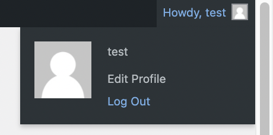
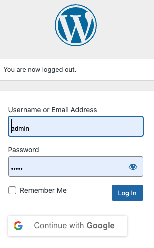

### **6. Checking Plugin**
---

### **Step 1:**
To check whether the plugin are working you need to first log out from wordpress by clicking the `Log Out` button.

### **Step 2:**
You should see the `Continue with Google` button in the bottom side of the login widget. 

please click to the button and try to login with the google account.
If you can login with your own Google account mean the Google OAuth is setup successfully.

