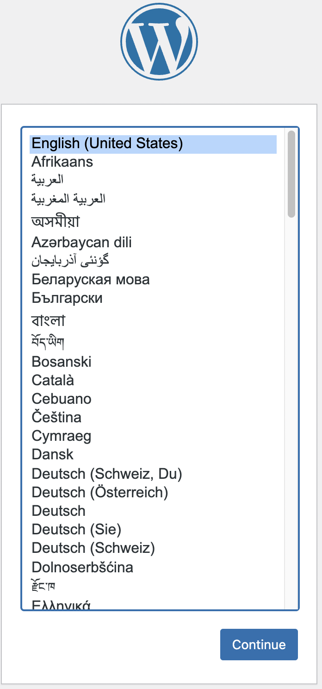
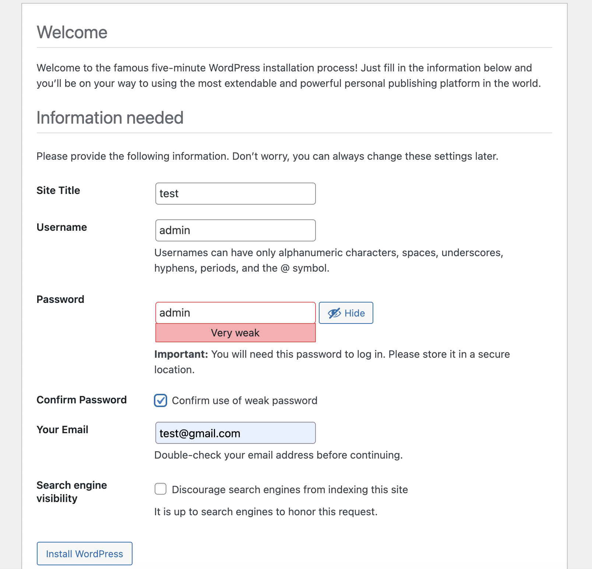
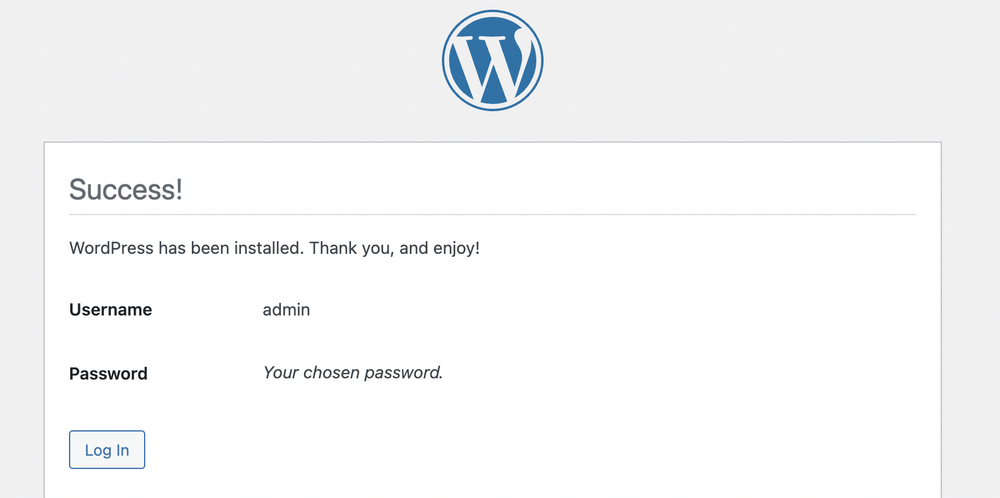

### 2. Setup your Wordpress
---
### After creating the WordPress website you need set up the Wordpress website.
  
### **Step 1:**
 Select the language and press `continue` button

  
### **Step 2:**

 fill the information like the following image and press the `Install WordPress` button.

### **Step 3:**
 The setup is already done and you can to click the `Log in` button to login to the WordPress
