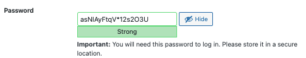
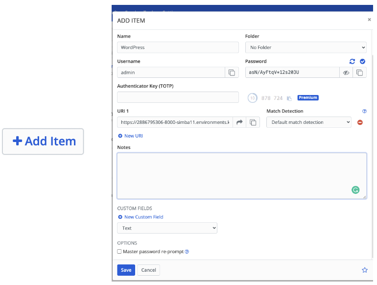
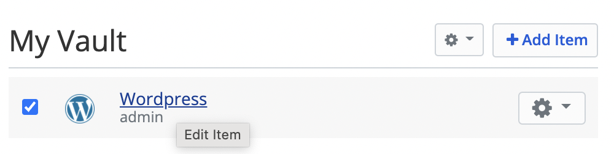
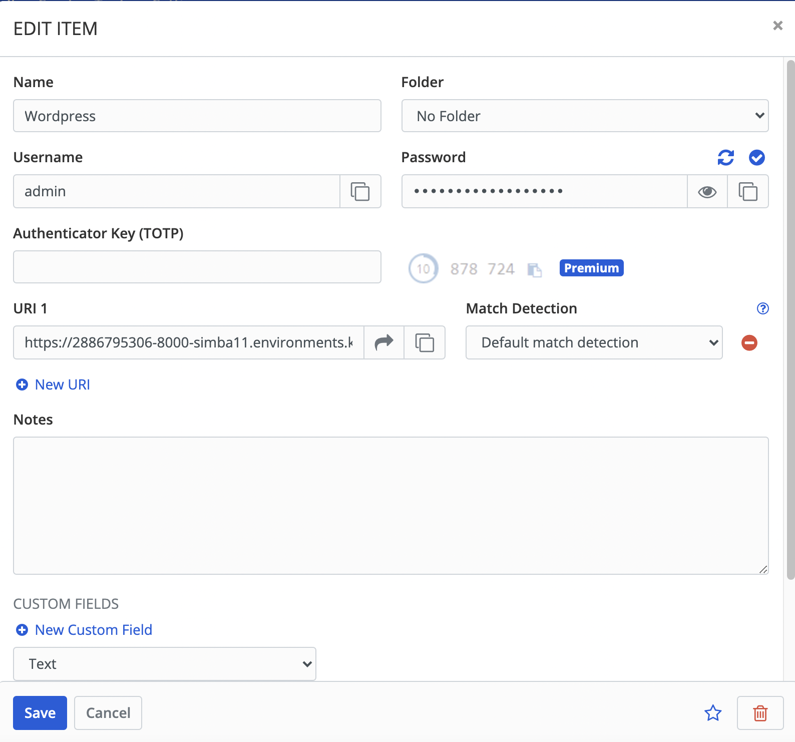

### **4. Prevent Brute-Force Attack**
---
### **Step 1: Use Password generate by WordPress**
#### When you set up your WordPress website. It will suggest a complex password like the following image:

#### The password that wordpress provide is long and complex which is hard to guess by the Brute-Force attack and it is suggested to use the password that WordPress provided.
  
### **Step 2: Open Bitwarden**
#### As the password generated by WordPress is complex which makes us hard to remember, It is better to have a password manager such as Bitwarden to manage the password and username Bitwarden is an open-source password manager which can help users to store and manage their passwords. To use Bitwarden, you need to access the following website and create an account:
#### https://vault.bitwarden.com/

  
### **Step 3: Save the Password in Bitwarden**
#### After you created an account, you need to press the `Add item` button. After that, a form will pop up and you need to input the username, the password generated by WordPress and the website URL into the form and click the `Save` button.

  

#### After you click the `Save` button, an item will show up to view the saved information you need to click the name tag of the item to view or edit the information:

  
#### Apart from using the complex password and storing it in Password Manager, there exist other methods that can prevent the brute-force attack. One of the methods is Two-factor authentication and will be talked about in the next course.

