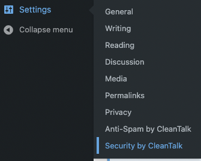
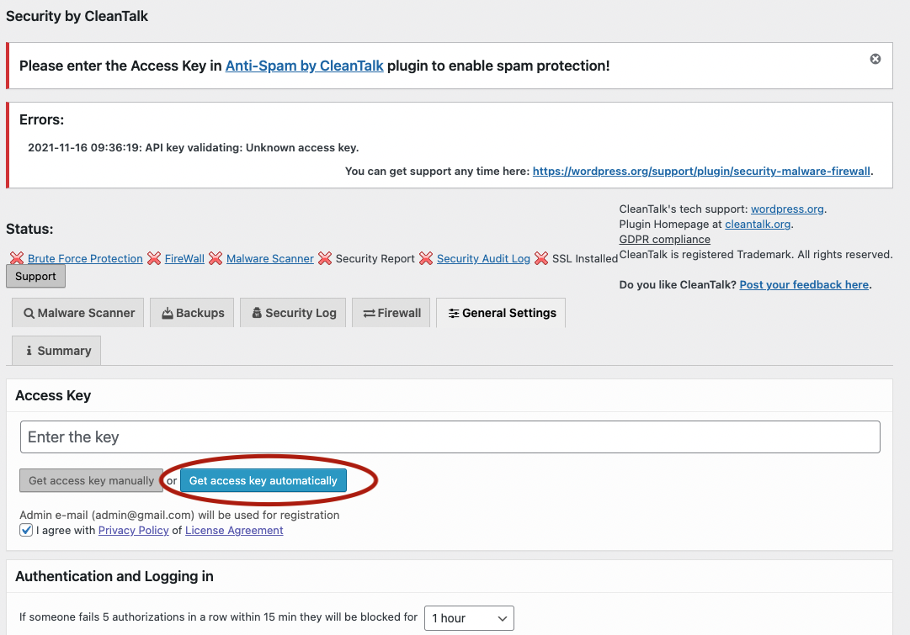
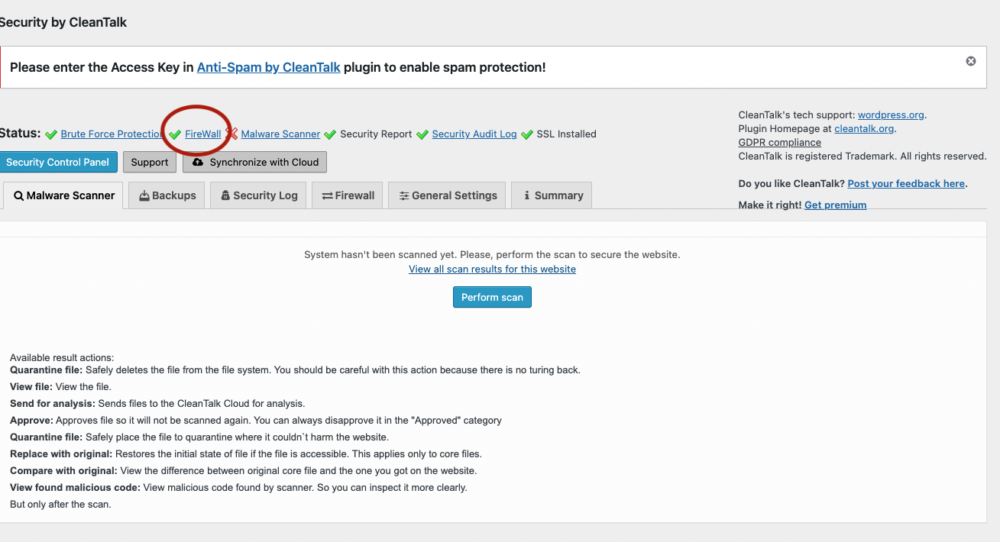
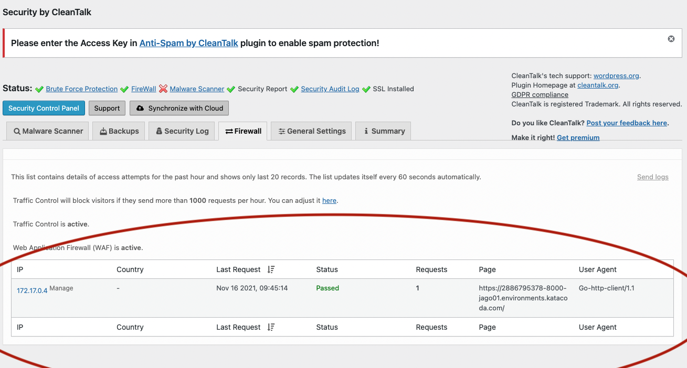

### **Set up the CleanTalk Plugin**
---
### **Step 1:** 
Click the `Security by CleanTalk` button which is inside the setting.

  

### **Step 2:** 
Click the `Get access key automatically` button.

  

### **Step 3:** 
Then the firewall is setup successfully to monitoring the Firewall you can click the `Firewall` button .

  

After access, You can see the records of traffic control of the firewall:

  

The traffic control of the firewall will block the visitors who send more than 1000 requests per hour which can prevent DDoS.