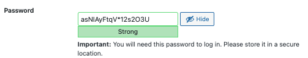

## **Prevent Brute-Force Attack**
---
## **Step 1: Use Password generate by WordPress**
### When you set up your WordPress website. It will suggest a complex password like the following image:



### The password that wordpress provide is long and complex which is hard to guess by the Brute-Force attack and it is suggested to use the password that WordPress provided.
<br></br>
## **Step 2: Open Bitwarden**
Bitwarden is an open source password manager which can help user to store and manage their password.To use the Bitwarden, you need to access the following website and create an account:
```sh
https://vault.bitwarden.com/{{copy}}
```

