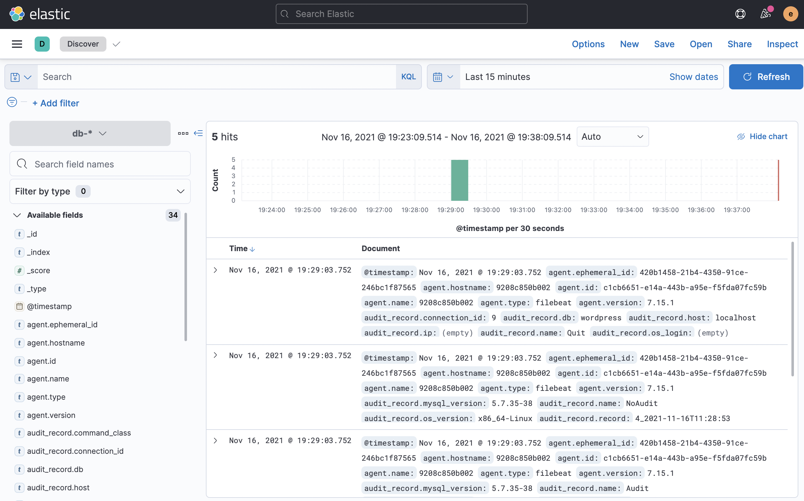
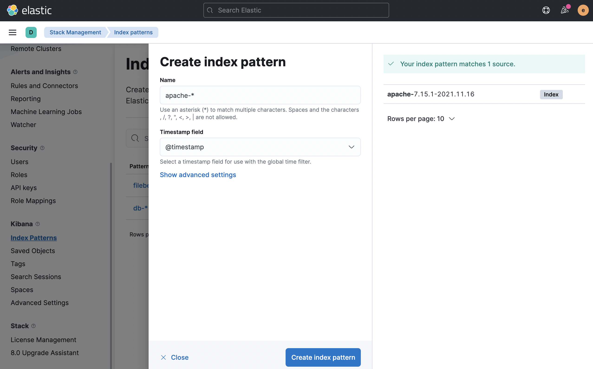
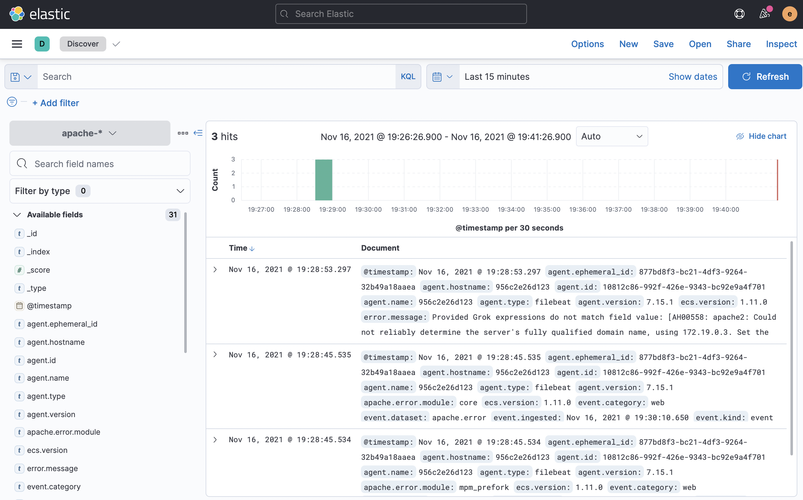

## What is index pattern?

Kibana requires an index pattern to access the Elasticsearch data that you want to explore. An index pattern selects the data to use and allows you to define properties of the fields.

An index pattern can point to one or more indices, data stream, or index aliases. For example, an index pattern can point to your log data from yesterday, or all indices that contain your data.

You can learn more from [here](https://www.elastic.co/guide/en/kibana/current/index-patterns.html)
 

### Access Kibana

After running `docker-compose up -d` (we have executed for you), you can access you Kibana in katacoda through https://[[HOST_SUBDOMAIN]]-5601-[[KATACODA_HOST]].environments.katacoda.com or click on the "Kibana" tab.

First, we should create an index pattern for filebeat so that we could explore it in Kibana.
 

### Login to Elasticsearch

We have setup a default login **username** and **password** for you (Please make sure you use a secure username and password in production):

**Username**: `elastic`{{copy}}
 
 
**Password**: `root`{{copy}}
 
 

### Go to create index pattern

1. Open the main menu, then click to Stack Management > Index Patterns.
2. Click Create index pattern.

 

### Create index pattern for percona database

1. Enter `db-*`{{copy}} for the index pattern

2. Select @timestamp for the **Timestamp field**

3. Click Create index pattern

You will be able to see the parsed log data through main menu > discover
(Select `db-*` as index pattern)

 

### Create index pattern for apache web server

1. Enter `apache-*`{{copy}} for the index pattern

2. Select @timestamp for the **Timestamp field**

3. Click Create index pattern

You will be able to see the parsed log data through main menu > discover
(Select `apache-*` as index pattern)

 
