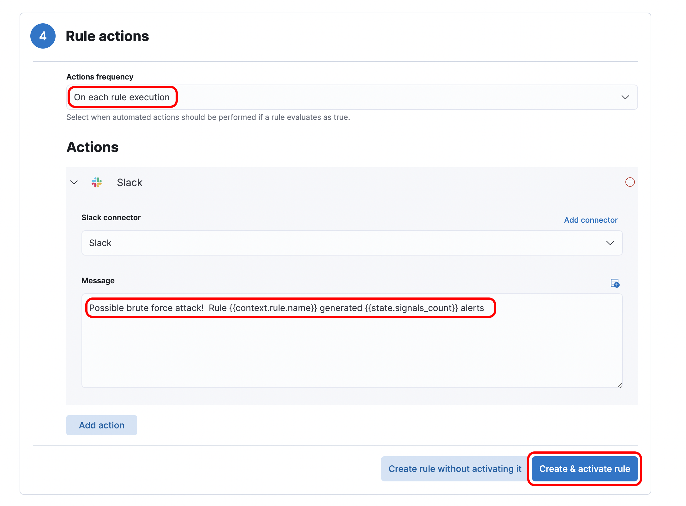

## What is brute force attack?

A brute force attack, also known as exhaustive search, is a cryptographic hack that relies on guessing possible combinations of the target password until the correct one is found. The longer the password, the more combinations need to be tested. Brute force attacks can be time consuming and difficult, and sometimes impossible, to perform if methods such as data obfuscation are used. However, if the password is weak, it may take only a few seconds and require almost no effort. For an attacker, weak passwords are like shooting fish in a barrel, which is why all organizations should enforce strong password policies across all users and systems.

You can learn more from [here](https://www.forcepoint.com/zh-hant/cyber-edu/brute-force-attack)

 

### Scenario

An attacker used social engineering tactics on one of our database administrators, the attacker now gained access to our remote mysql container and is now trying to brute force the database root account password.

 

### Create an detection rule

For detecting this kind of attacks, we could create a detection rules that would alert us when the rule's criteria are met.

You can learn more from [here](https://www.elastic.co/guide/en/security/current/rules-ui-create.html#rules-ui-create)

1. Open the main menu, then click to Security > Overview.

2. Under the **detect** title click **Rules**, then click **Create new rules**

 

### Define rule

1. Select the rule type as **Threshold**
2. Enter `db-*`{{copy}} for the index pattern

3. Enter `not audit_record.status : 0 AND audit_record.name : Connect`{{copy}} for the KQL query
    
    
   `not audit_record.status : 0` means select all with record with unsuccessful login
    
   `audit_record.name : Connect` The type of the record, “Connect” means login

(The [Kibana Query Language](https://www.elastic.co/guide/en/kibana/7.15/kuery-query.html) (KQL) offers a simplified query syntax and support for scripted fields. )

4. Input 10 for **Threshold**, the click **Continue**
   The detection rule will trigger if any user login failed 10 or more times

 

### About rule

For the **Name** enter `Possible brute force attack`{{copy}}

For the **Description** enter `Any user login failed 10 or more times`{{copy}}

Default severity `high`, the click **Continue**

 

## Schedule Rule

For testing purpose we set schedule to run in every `5 seconds`, the click **Continue**

 

## Alerting

Once the rule's criteria are met we can alert it to a connector. In this case, we use `Slack`

1. First setup an account in [slack](https://slack.com/get-started#/createnew)
2. The Go to https://my.slack.com/services/new/incoming-webhook
3. Select a default channel for the integration, then click **Add Incoming WebHooks integration**

4. Copy your Webhook URL

5. Back to Kibana, Click **slack icon** > **Create a connector**, then enter **Name** and paste the **Webhook URL** > Click **Save**

6. Change the Message to `Possible brute force attack! Rule {{context.rule.name}} generated {{state.signals_count}} alerts`{{copy}}

7. Click **Create & activate rule**

## Simulate a brute force attack in the database container

Run `docker exec -it db bash`{{execute}}

Run `for i in {1..20}; do mysql -u root; done`{{execute}} for simulating 

