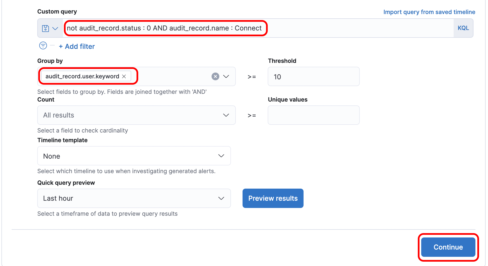
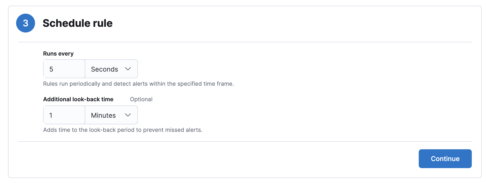

## What is DDOS attack?

A distributed denial-of-service (DDoS) attack is a malicious attempt to disrupt the normal traffic of a targeted server, service or network by overwhelming the target or its surrounding infrastructure with a flood of Internet traffic.

DDoS attacks achieve effectiveness by utilizing multiple compromised computer systems as sources of attack traffic. Exploited machines can include computers and other networked resources such as IoT devices.

From a high level, a DDoS attack is like an unexpected traffic jam clogging up the highway, preventing regular traffic from arriving at its destination.

You can learn more from [here](https://www.cloudflare.com/learning/ddos/what-is-a-ddos-attack/)
Source: Cloudflare

 

## Difference between a DDoS attack and a DOS attack

The distinguishing difference between DDoS and DoS is the number of connections utilized in the attack. Some DoS attacks, such as “low and slow” attacks like Slowloris, derive their power in the simplicity and minimal requirements needed to them be effective.

DoS utilizes a single connection, while a DDoS attack utilizes many sources of attack traffic, often in the form of a botnet. Generally speaking, many of the attacks are fundamentally similar and can be attempted using one more many sources of malicious traffic. Learn how Cloudflare's DDoS protection stops denial-of-service attacks.

You can learn more from [here](https://www.cloudflare.com/zh-cn/learning/ddos/glossary/denial-of-service/)
Source: Cloudflare

 

### Scenario

Our wordpress site suddenly became slow because an attacker DDOSed our apache web server that hosts wordpress. Now we need to create an alert to detect this attack so that we can prevent it from happening.

 

### Create an detection rule

For detecting this kind of attacks, we could create a detection rules that would alert us when the rule's criteria are met.

You can learn more from [here](https://www.elastic.co/guide/en/security/current/rules-ui-create.html#rules-ui-create)

1. Open the main menu, then click to Security > Overview.

2. Under the **detect** title click **Rules**, then click **Create new rules**

 

### Define rule

1. Select the rule type as **Threshold**
2. Enter `apache-*`{{copy}} for the index pattern

3. Enter `not audit_record.status : 0 AND audit_record.name : Connect`{{copy}} for the KQL query
    
    
   `not audit_record.status : 0` means select all with record with unsuccessful login
    
   `audit_record.name : Connect` The type of the record, “Connect” means login

(The [Kibana Query Language](https://www.elastic.co/guide/en/kibana/7.15/kuery-query.html) (KQL) offers a simplified query syntax and support for scripted fields. )

4. Input 10 for **Threshold**, the click **Continue**
   The detection rule will trigger if any user login failed 10 or more times

 

### About rule

For the **Name** enter `Possible brute force attack`{{copy}}

For the **Description** enter `Any user login failed 10 or more times`{{copy}}

Default severity `high`, the click **Continue**

 

## Schedule Rule

For testing purpose we set schedule to run in every `5 seconds`, the click **Continue**

 

## Alerting

Once the rule's criteria are met we can alert it to a connector. In this case, we use `Slack`

1. First setup an account in [slack](https://slack.com/get-started#/createnew)
2. The Go to https://my.slack.com/services/new/incoming-webhook
3. Select a default channel for the integration, then click **Add Incoming WebHooks integration**

4. Copy your Webhook URL

5. Back to Kibana, Click **slack icon** > **Create a connector**, then enter **Name** and paste the **Webhook URL** > Click **Save**

6. Change the Message to `Possible brute force attack! Rule {{context.rule.name}} generated {{state.signals_count}} alerts`{{copy}}

7. Click **Create & activate rule**

## Simulate a brute force attack in the database container

Run `docker exec -it db bash`{{execute}}

Run `for i in {1..20}; do mysql -u root; done`{{execute}} for simulating brute force attack (generate fail login for 10 times)

You will now see an alert message pop up in your slack channel

In security > overview you will also see alert is triggered

