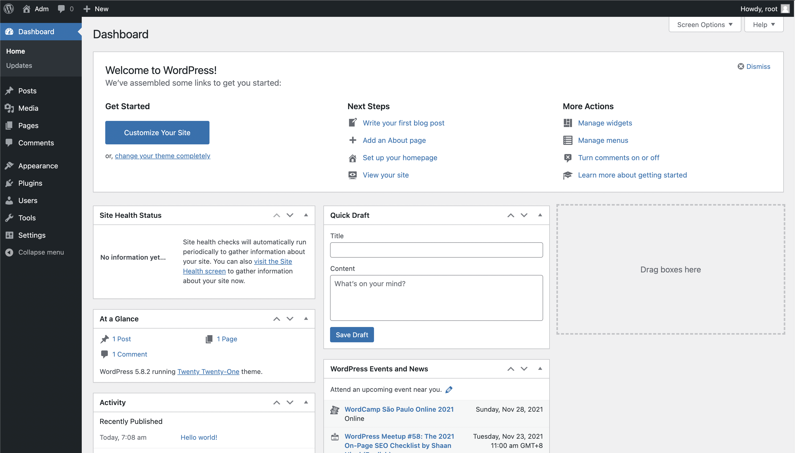

## What is DDOS attack?

A distributed denial-of-service (DDoS) attack is a malicious attempt to disrupt the normal traffic of a targeted server, service or network by overwhelming the target or its surrounding infrastructure with a flood of Internet traffic.

DDoS attacks achieve effectiveness by utilizing multiple compromised computer systems as sources of attack traffic. Exploited machines can include computers and other networked resources such as IoT devices.

From a high level, a DDoS attack is like an unexpected traffic jam clogging up the highway, preventing regular traffic from arriving at its destination.

You can learn more from [here](https://www.cloudflare.com/learning/ddos/what-is-a-ddos-attack/)
Source: Cloudflare

 

## Difference between a DDoS attack and a DOS attack

The distinguishing difference between DDoS and DoS is the number of connections utilized in the attack. Some DoS attacks, such as “low and slow” attacks like Slowloris, derive their power in the simplicity and minimal requirements needed to them be effective.

DoS utilizes a single connection, while a DDoS attack utilizes many sources of attack traffic, often in the form of a botnet. Generally speaking, many of the attacks are fundamentally similar and can be attempted using one more many sources of malicious traffic. Learn how Cloudflare's DDoS protection stops denial-of-service attacks.

You can learn more from [here](https://www.cloudflare.com/zh-cn/learning/ddos/glossary/denial-of-service/)
Source: Cloudflare

 

### Scenario

Our wordpress site suddenly became slow because an attacker DDOSed our apache web server that hosts wordpress. Now we need to create an alert to detect this attack so that we can prevent it from happening.

 

### Create an detection rule

For detecting this kind of attacks, we could create a detection rules that would alert us when the rule's criteria are met.

You can learn more from [here](https://www.elastic.co/guide/en/security/current/rules-ui-create.html#rules-ui-create)

Open the main menu, then click to Security > Overview.

Under the **detect** title click **Rules**, then click **Create new rules**

 

### Define rule

1. Select the rule type as **Threshold**
2. Enter `apache-*`{{copy}} for the index pattern

Enter `NOT http.response.status_code : 200`{{copy}} for the KQL query
 
 
`NOT http.response.status_code : 200` means select all with record with unsuccessful login
 

(The [Kibana Query Language](https://www.elastic.co/guide/en/kibana/7.15/kuery-query.html) (KQL) offers a simplified query syntax and support for scripted fields. )

As we know DOS would generate large numbers of HTTP requests flood the server many times it is some error request, resulting in denial-of-service, therefore we set a threshold for detecting it.

1. Select `source.ip.keyword` for **Group by**, so we could count the amount of request per ip
2. Input 200 for **Threshold**, the click **Continue**
   The detection rule will trigger if there is 200 or more http requests per 10 sec (that we set in the schedule later) for an ip address

 

### About rule

For the **Name** enter `Possible DDOS/DOS attack`{{copy}}

For the **Description** enter `200 or more http requests per 10 sec for an ip address `{{copy}}

Default severity `high`, the click **Continue**

 

## Schedule Rule

We set schedule to run in every `10 seconds`, the click **Continue**

 

## Alerting

Once the rule's criteria are met we can alert it to a connector. In this case, we use `Slack`.
 
We have setup the Slack webhook in `step4`, so we can just click the Slack icon for connecting it.
 

1. Change the Message to `Possible DDOS/DOS attack! Rule {{context.rule.name}} generated {{state.signals_count}} alerts`{{copy}}

2. Set **actions frequency** as **On each rule execution**

3. Click **Create & activate rule**

## Simulate a JavaScript-based DOS attack

Please use **chrome** browser for the simulation:
 

Please setup the wordpress and go to the **admin dashboard home page**. (You can access you WordPress in katacoda through https://[[HOST_SUBDOMAIN]]-8000-[[KATACODA_HOST]].environments.katacoda.com or click on the "WordPress" tab.)

Then, open the [chrome dev tools](https://developer.chrome.com/docs/devtools/open/)

Then click on the **console** tab and paste the following javascript into the console. Then press **enter** to run it.

<pre class="file" data-target="clipboard">
function imgflood() {
  let URI = '/wp-admin/ddos.php?'
  let pic = new Image()
  let rand = Math.floor(Math.random() * 1000)
  pic.src = window.location.origin+URI+rand+'=val'
}

let ddosTimer = setInterval(imgflood, 1); //Run it every 1 ms

setTimeout(() => clearInterval(ddosTimer), 15000); //Stop running in 15 sec
</pre>

The script will generate 3744 invalid HTTP requests to the wordpress server in 15 seconds, making this a Layer 7 attack. You can learn more from [here](https://blog.cloudflare.com/an-introduction-to-javascript-based-ddos/)

In security > overview you will also see alert is triggered

