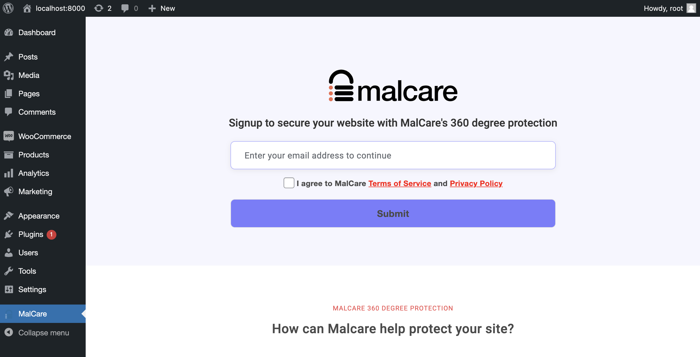
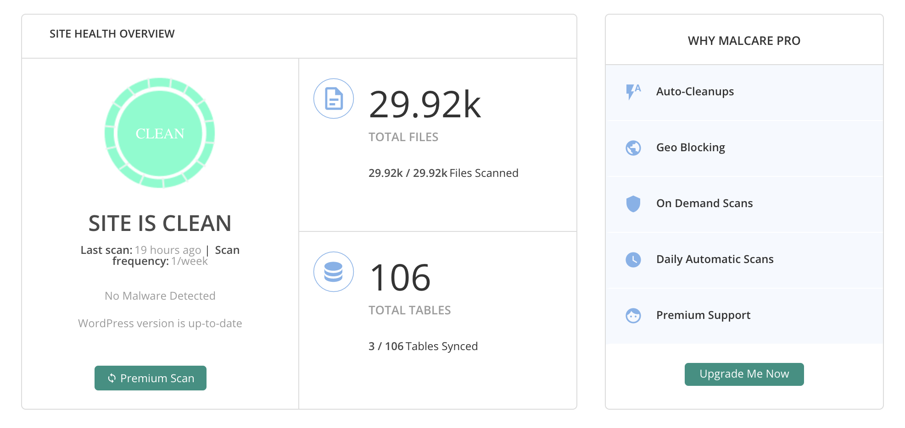
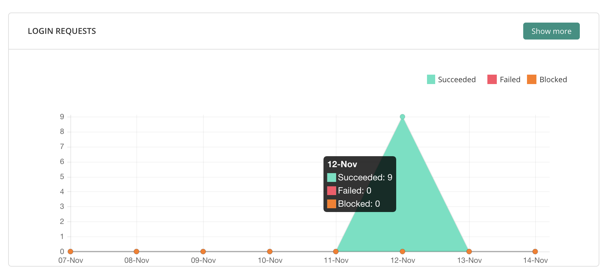

## **2. Setup Malcare Plugin**
---
The setup page of `Malcare` will appear automatically after clicking the `Activate` button.

## **Step 1:** 
Typing the email and tick the agreement box. Then press the `submit`.

After clicking the submit button, it will direct to the `Malcare` page for scanning the website.

## **Step 2:** 
After successful scanning the webiste, you can click the `Malcare` option for monitoring any data breach events from external and internal attacks.

Showing the `Site health overview`

Showing the `Traffic requests`

Showing the `Login requests`

Show the `Admin Login` and existing `Bot`
