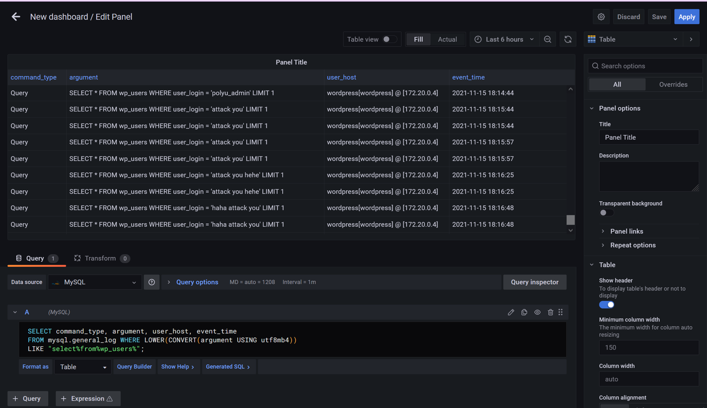
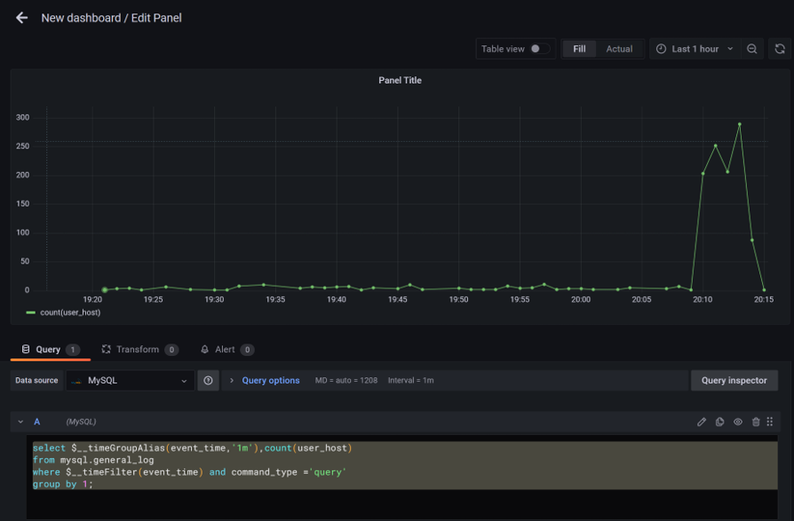
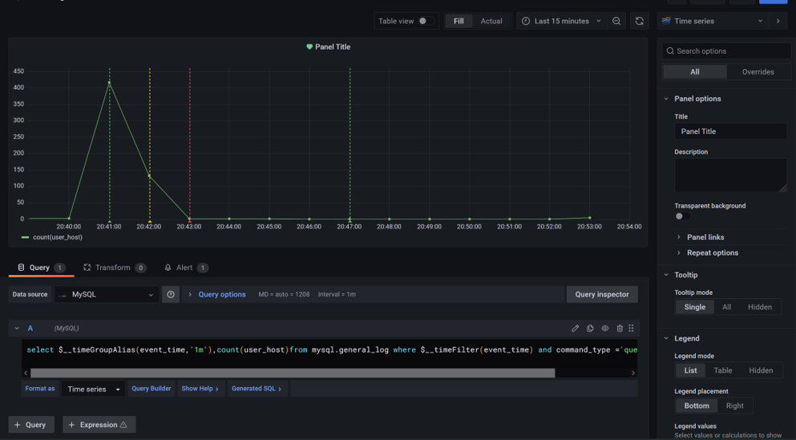

# Step 2 - Monitoring

We can use gafana for monitoring

    select command_type,argument,user_host,event_time From mysql.general_log Where lower(convert(argument using utf8))like "select%from%wp_users%";

    select $__timeGroupAlias(event_time,'1m'),count(user_host)from mysql.general_log where $__timeFilter(event_time) and command_type ='query'group by 1;

