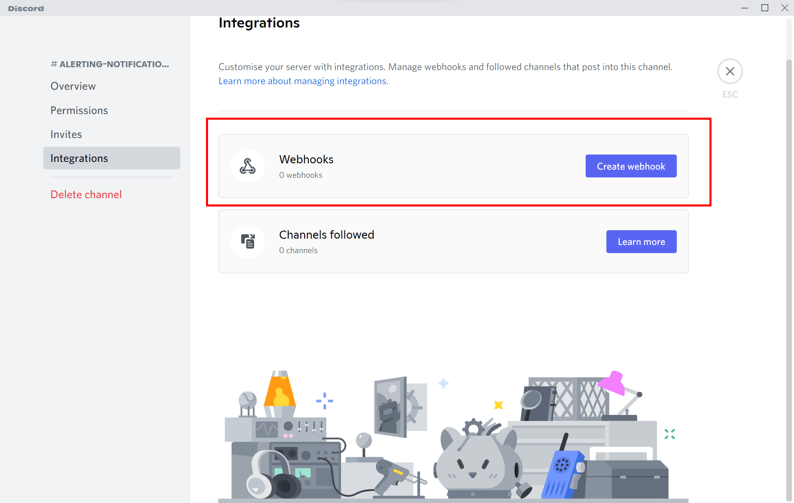
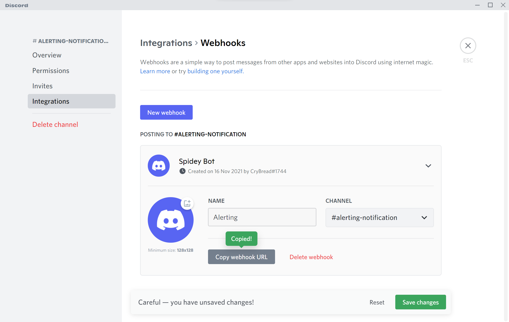
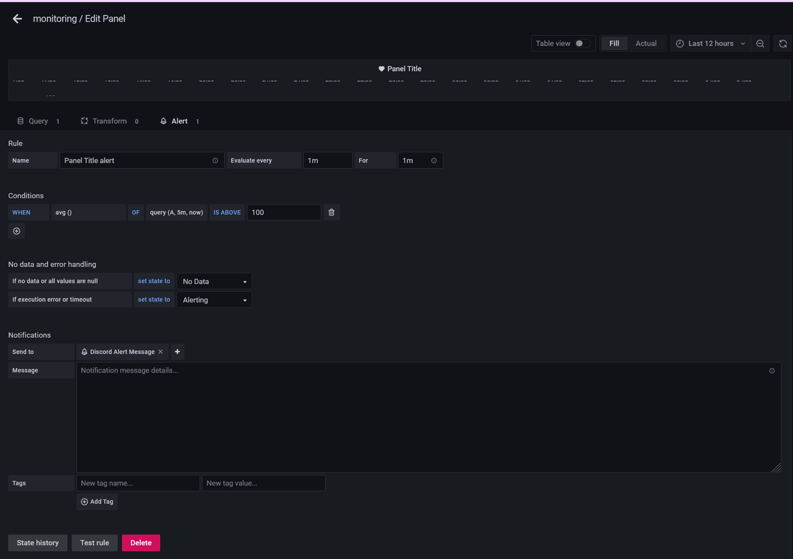

# Step 3 - Alerting via Discord
## Getting the Webhook URL in Discord
First, go to Discord > choose a channel you want to receive alert message

Edit channel > Intergrations > Webhooks and create Webhook

Input NAME > copy the Webhook URL

## Go back to the grafana and go to "Alerting" page

Input name, type of receive alert message and Webhook URL

## Alert Setting in specific Panel > Alert
Enter to the panel which is monitoring atrack and want to get alert message, and refer to the below setting

In this part, it sets the time and the condition for sending the alert message while the system is suspiciously attack

## Receive Message via Discord

