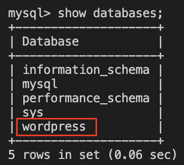

## **Checking existing databases**
---
We should firstly check the existing databases and choose the WordPress database that we would like to backup.
  

## 1. Access to the mysql server
Using the following docker command for connecting to the percona db container.
 
`docker exec -it db bash`{{execute}}

Using the following command for login to the mysql server.
 
`mysql -u root -p`{{execute}}

The password of the mysql server is:
 
`d2Oqadruj9*`{{execute}}
  

## 2. Checking the existing databases
Then, now we are inside the mysql server and we could start using SQL statment for selecting data.

We can use the following SQL statment for showing all the databases and finding the database that we would like to backup.
 
`show databases;`{{execute}}

Expected Output:
 

'wordpress' is the database that we would like to use. This database would hold all of the data in WordPress, particularly the customer and transaction information, which are the data that is the most important and should be backed up. Therefore, we should backup this database.