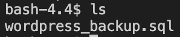

## **Backup the WordPress database by using Mysqldump**
---
## 1. Access the backup bash
Exit the mysql server by using the following statment for accessing the bash of the percona db container.
 
`exit`{{execute}}

Using the following command for accessing the backup bash.
 
`cd /var/backup`{{execute}}
  

## 2. Backup the Wordpress database
Using the following command for creating a backup file for storing the `wordpress` database.
 
`mysqldump -u root -p wordpress > wordpress_backup.sql`{{execute}}

The password of mysqldump is:
 
`d2Oqadruj9*`{{execute}}

As for the command:
<ul>
    <li>
        <b>"mysqldump"</b> is the method that we would like to use for backing up the database.
    </li>
    <li>
        <b>"-u root -p"</b> is for login as root user with all the permission.
    </li>
    <li>
        <b>"wordpress"</b> is the database that we would like to choose from mysql server.</b> 
    </li>
    <li>
        <b>">"</b> means transfer to 
    </li>
    <li>
        <b>"wordpress_backup.sql"</b> is the backup file name that we want and the format of this file is ".sql".
    </li>
</ul>

After creating the backup file for storing the `wordpress` database. Next, we would like to confirm the backup file is exist inside the container.

Using the following command for listing out all files.
 
`ls`{{execute}}

Expected Output:
 

We can see that the backup file of "wordpress_backup.sql" is already been created. It means that we are successfully backing up the `wordpress` database.