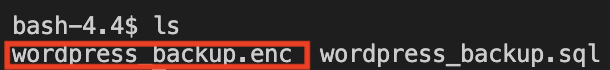

## **Encrypt the backup file by using OpenSSL**
---
## 1. Encrypt the WordPress backup file
In this part, we would like to use OpenSSL for doing file encryption. The high secure cryptographic keys of 256bit would be chosen for doing the encryption.

Using the following command for encrypting the `wordpress_backup.sql` file.
 
`openssl enc -aes-256-cbc -in wordpress_backup.sql -out wordpress_backup.enc`{{execute}}

The password of aes-256-cbc encryption is:
 
`d2Oqadruj9*`{{execute}}

The password of Verifying - enter aes-256-cbc encryption is:
 
`d2Oqadruj9*`{{execute}}

As for the command:
<ul>
    <li>
        <b>"openssl"</b> is the method that we would like to use.
    </li>
    <li>
        <b>"enc"</b> means encryption method.
    </li>
    <li>
        <b>"aes-256-cbc"</b> means that we would like to employ cryptographic keys of 256bit length for the encryption.
    </li>
    <li>
        <b>"-in wordpress_backup.sql"</b> means the input file is "wordpress_backup.sql" file.
    </li>
    <li>
        <b>"-out wordpress_backup.enc"</b> means the output file is "wordpress_backup.enc" file that is customise by ourselves. 
        *The format of "enc" means this file is an encrypted file.
    </li>
</ul>
  

## 2. Confirm the backup file is exist
Using the following command for listing out all files.
 
`ls`{{execute}}

Expected Output:

We can see that the encrypted backup file of "wordpress_backup.enc" is already been created. It means that we are successfully encrypting the `wordpress_backup.sql` backup file.