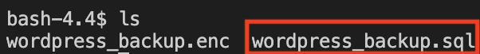

## **Decrypt the encrypted backup file by using OpenSSL**
---
If we want to make sure the encrypted file is working and it can reverse to the original file. We would like to first delete the original file and decrypt the encrypted file to the original file.
  

## 1. Delete the existing backup file
Using the following command for deleting the original backp file.
 
`rm -f wordpress_backup.sql`{{execute}}
  

## 2. Check the existing file
Using the following command for listing out all files.
 
`ls`{{execute}}

Expected Output:
 

We can see that it only contains the encrypted file after running the remove command. It means that we successfully delete the original file.
  

## 3. Decrypt the encrypted file to original file
Using the following command for decrypting the `wordpress_backup.enc` encrypted file.
 
`openssl enc -aes-256-cbc -d -in wordpress_backup.enc -out wordpress_backup.sql`{{execute}}

The password of aes-256-cbc decryption is:
 
`d2Oqadruj9*`{{execute}}

As for the command:
<ul>
    <li>
        <b>"openssl"</b> is the method that we would like to use.
    </li>
    <li>
        <b>"enc"</b> means encryption method.
    </li>
    <li>
        <b>"aes-256-cbc"</b> means that we would like to employ cryptographic keys of 256bit length for the encryption.
    </li>
    <li>
        <b>"-d"</b> means that we would like to decrypt method.
    </li>
    <li>
        <b>"-in wordpress_backup.enc"</b> means the input file is "wordpress_backup.sql" file.
    </li>
    <li>
        <b>"-out wordpress_backup.sql"</b> means the output file is "wordpress_backup.enc" file that is customise by ourselves. 
    </li>
</ul>
  

## 2. Confirm the backup file is exist again
Using the following command for listing out all files.
 
`ls`{{execute}}

Expected Output:

We can see that the backup file of "wordpress_backup.sql" is exist after decryption. It means that we are successfully decrypting the `wordpress_backup.enc` backup file to the original.