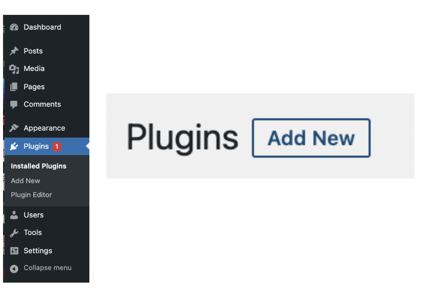
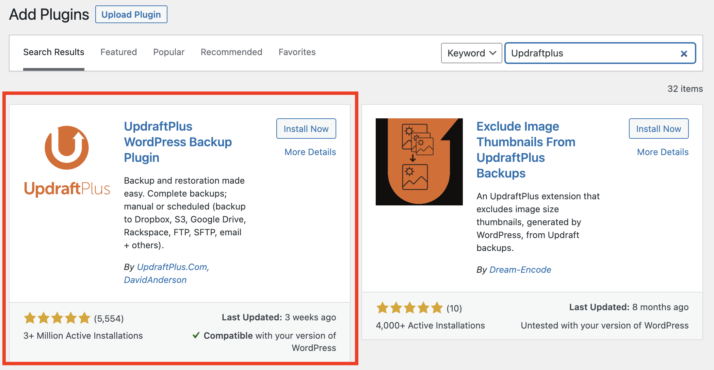
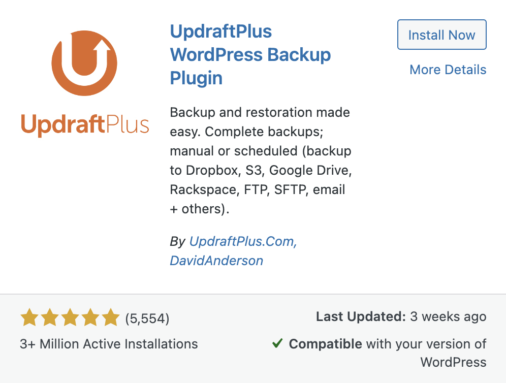
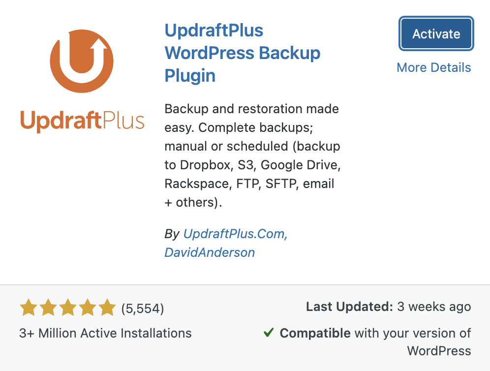

## **Download and Activate Updraftplus Plugin**
---
## 1. Add new plugin
Click the plugins in the menu bar and click the `Add New button` to add a new plugin for the WordPress.

  

## 2. Search plugin
Input the `Updraftplus `in the search bar and the Updraftplus plug will appear.

  

## 3. Install and Active plugin
Click `Install Now `button to install the plugin and after installing the `Activate` button will show up and click it to activate the plugin.

