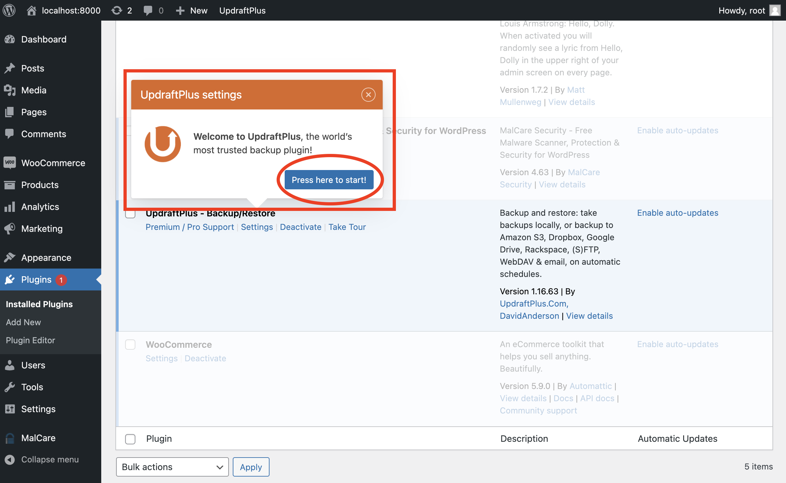
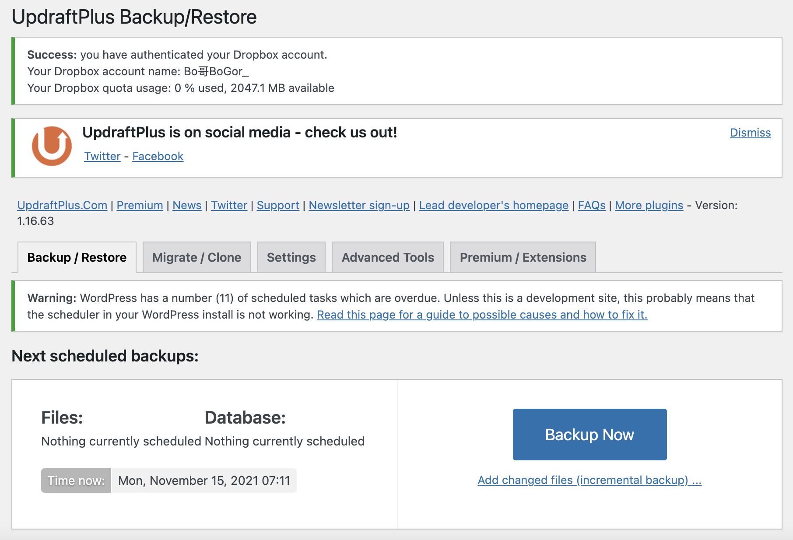
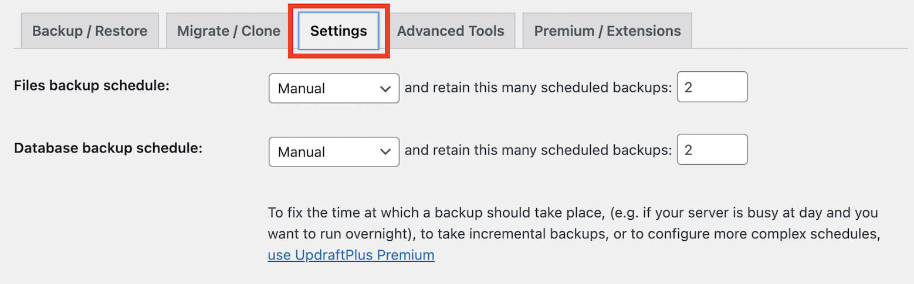
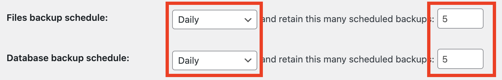

## **Setup Updraftplus plugin**
---
The plugin page will be redirected automatically after clicking the `Activate` button. 

We should press the `Press here to start` button for going to page of Updraftplus.

Home page of Updraftplus

  

## 1. Setting page of Updraftplus
Click the `Setting` tag at the menu bar and go to the setting page.

  

## 2. Setting up backup schedule
In this part, we would like to backup all WordPress files and database. Also, we would like to have frequent backup.

Therefore, we should choose the time between each backup to `Daily` and numbers of backup to `5`.

