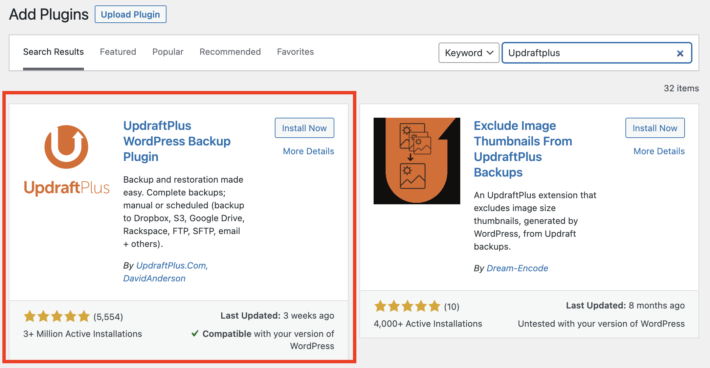

## **1. Download and Activate the Plugin**
---
## **Step 1:** 
Click the plugins in the menu bar and click the `Add New button` to add a new plugin for the WordPress.

## **Step 2:**
Input the `Updraftplus `in the search bar and the Updraftplus plug will appear.

## **Step 3:**
Click `Install Now `button to install the plugin and after installing the `Activate` button will show up and click it to activate the plugin.

