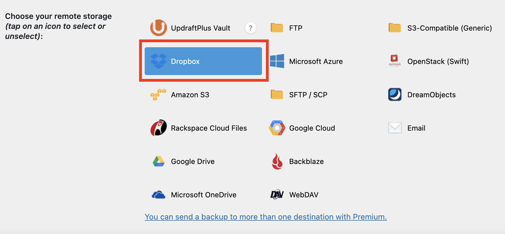
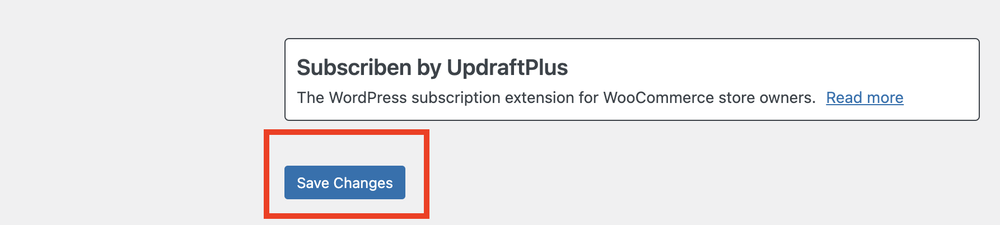
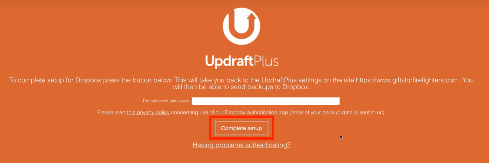

## **Step 3: Linking with Dropbox**
---
We would like transfer the backup files and database to a cloud storage platform `Dropbox`.

The reason why we would like to choose Dropbox is that it can provide a more **secure** version of encryption.

Comparing between Dropbox and Google drive - Mainly focusing on security concern
<table border="1">
    <tr>
        <td>Dropbox</td>
        <td>Google Drive</td>
    </tr>
        <tr>
        <td>Advanced Encryption Standard (AES) 256-bit encryption</td>
        <td>128-bit encryption for data at rest</td>
    </tr>
</table>
Dropbox has a higher encryption bit for protecting the data.
  

## 1. Choosing Dropbox platform
Clicking the Dropbox tag.

Clicking `Save Changes` button for saving your option.

## 2. Complete setup
The complete page will appear automatically after clicking the `Save Changes` button.

It will rediret to the login page after clicking the `Complete` button and we should login back to the home page of Updraftplus.