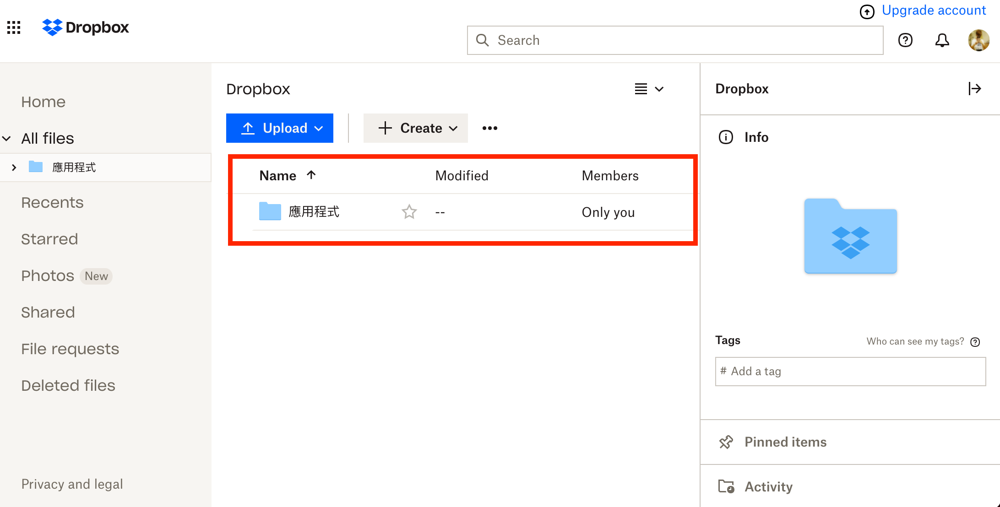

## **Step 4: Backup your website**
---
## 1. Backup website locally in WordPress
In the home page of Updraftplus, we should firstly click the `Backup Now`.

It will show a popup screen after clicking the `Backup Now` button from the home page. Then, we should click the `Backup Now` button inside the popup widget for backing up our website.

Now, we can check the backup files and database locally in the widget of `Existing backups`.

It would include 5 files.
<ul>
    <li>Database</li>
    <li>Plugin</li>
    <li>Themes</li>
    <li>Uploads</li>
    <li>Others</li>
</ul>
  

## 2. Checking the existing backups at Dropbox
Inside the page of you Dropbox, a folder will be generated automatically in Dropbox after backup the files in WordPress.

Inside that folder, it will contain another folder for storing the backup files of Updraftplus.

5 files which are mentioned above will also be successfully backup in Dropbox.
