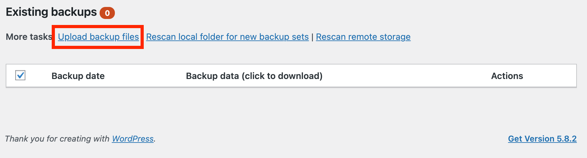
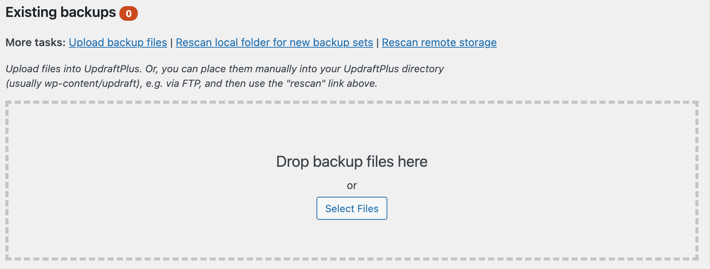
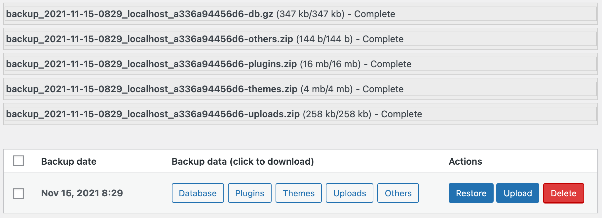
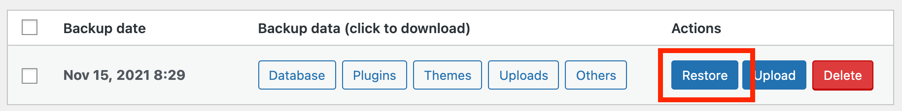
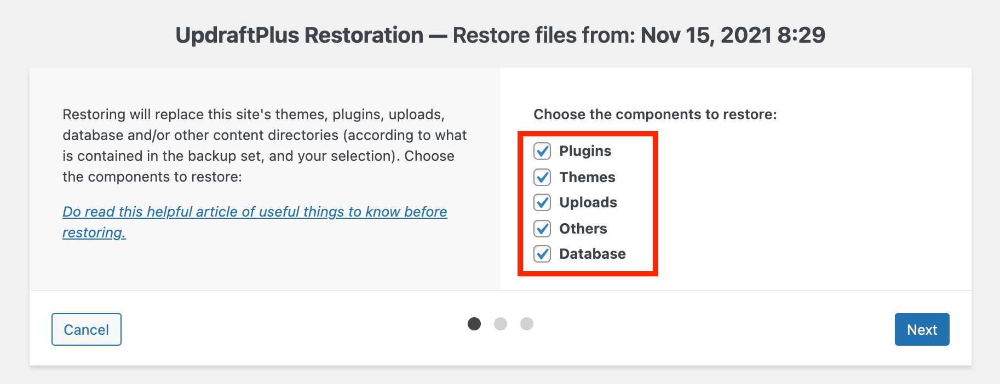
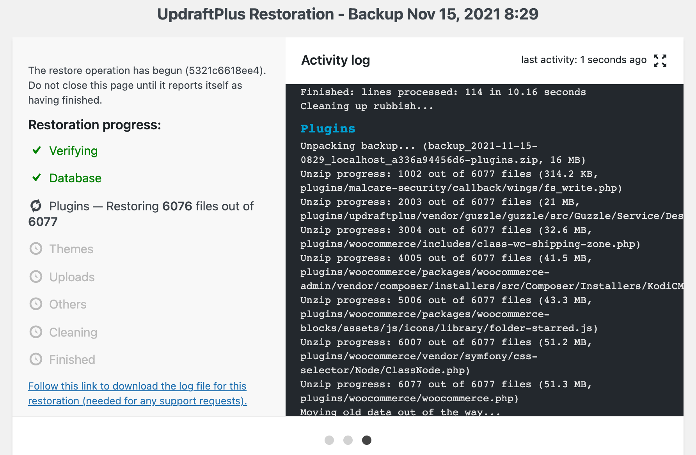
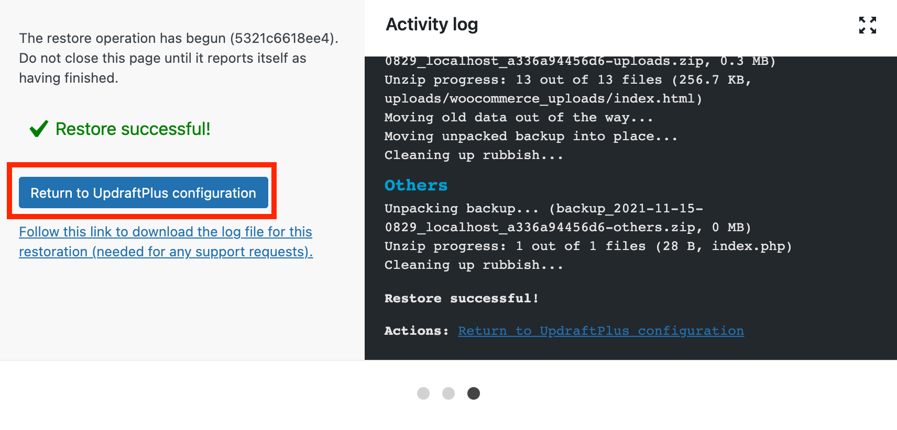

## **Step 5: Restore backup to your website**
---
## 1. Checking the backup files at your device
You should make sure all the backup files are already downloaded to your device.
  

## 2. Upload your backup files to Updraftplus
Clicking the `Upload backup files` for droping the backup files to Updraftplus.

5 files will be successfully completed uploading after dragging the files to the widget.

  

## 3. Restore you backup
Clicking the `Restore` button in the action widget.

The UpdraftPlus Restoration page will be directed after clicking the `Restore` button. We should choose all the components for restoring and click the `Next` button.

It will Starting restore your files to WordPress.

Clicking the `Return to UpdraftPlus configuration` button for backing to Updraftplus dashboard after successfully restoring.

The website will be successfully restored.