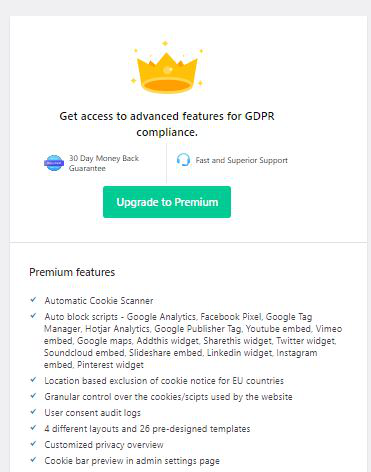

# Well done!!!

You just learnt how to install 'CookieYes' plugin to fulfill the GDPR compliance requirement.
 
You can subscribe the premium version to get more features such as Cookie scanner, auto block scripts or output auditing logs.

