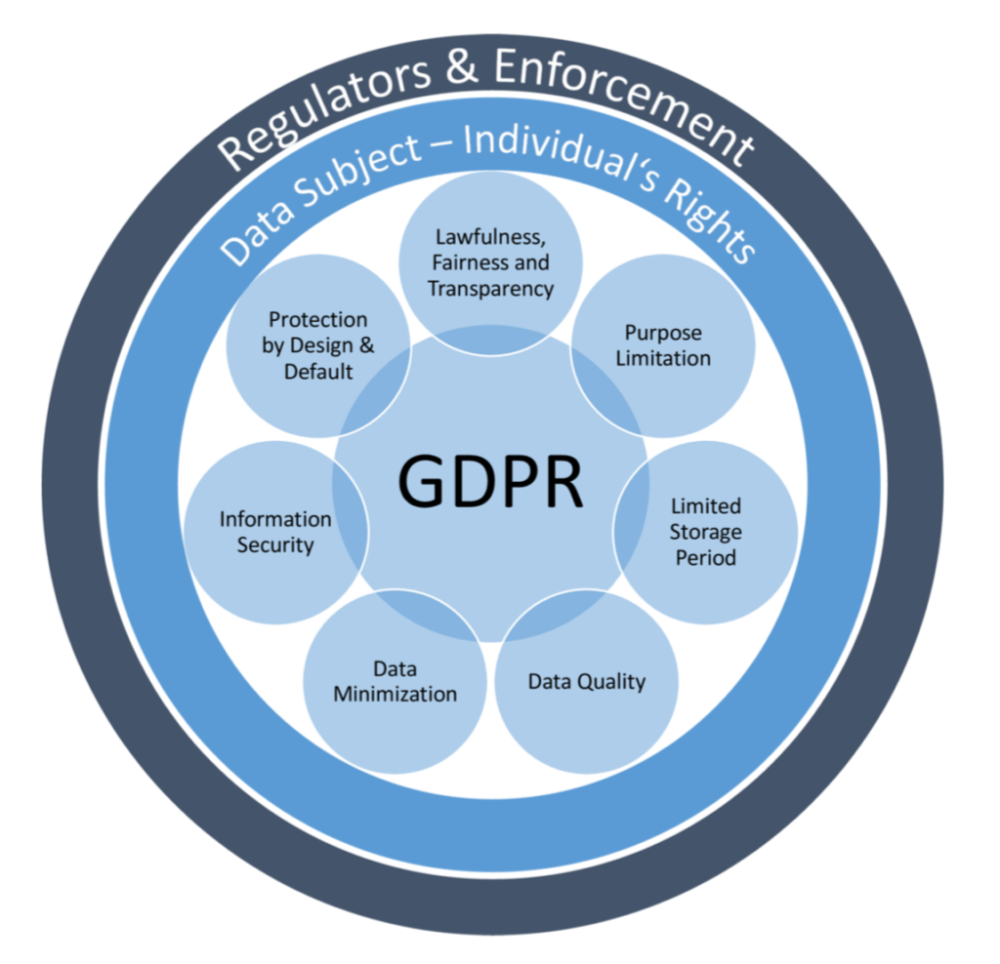

### Objectives of GDPR

GDPR is a regulation in EU law on data protection and privacy in the European Union (EU) and the European Economic Area (EEA). The GDPR's primary aim is to enhance individuals' control and rights over their personal data and to simplify the regulatory environment for international business.

### Principles of GDPR 

There are seven principles in GDPR includes:

1. Lawfulness: Which means people in the company should not do anything unlawful with customer personal data such as data selling. 

2. Fairness and transparency: It means the a company need to declare the purpose and perspective of the data process before it proceed. 

3. Purpose limitation: Data need to be collected by specified, explicit, and legitimate purposes.

4. Data minimisation: should not store any processed data.

5.  Accuracy: It means the data need to keep up to date, those data that is incorrect and out of date need to be erased or rectified.

6. Storage limitation: It means a company can only keep customers' data for archiving purposes in the public interest, scientific or historical research purposes, or statistical purposes.
 
7. Integrity and confidentiality: Database need to place in secure location that passed a security assessment to prevent data being compromised.  

