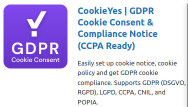

### 'CookieYes' GDPR plugin in wordpress 

To apply GPDR compliance to the wordpress site we can use a wordpress plugin called 'CookieYes' This plugin will make your wordpress site a GDPR compliant. 

### Key features

* Automatic scanning and categorization of cookies.
*  Display the list of cookies on your cookie policy page by using a shortcode.
* Adds a subtle cookie banner to your WordPress website either in the header or footer
*  Makes the cookie notice bar disappear after a few seconds