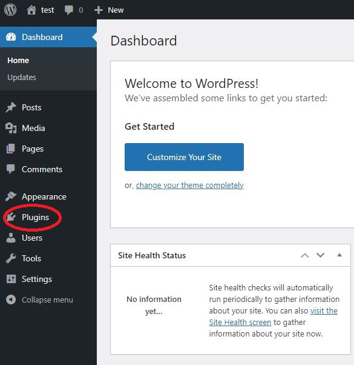
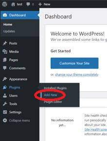
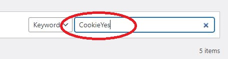
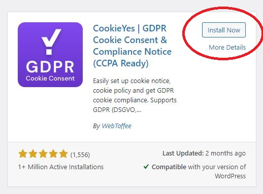
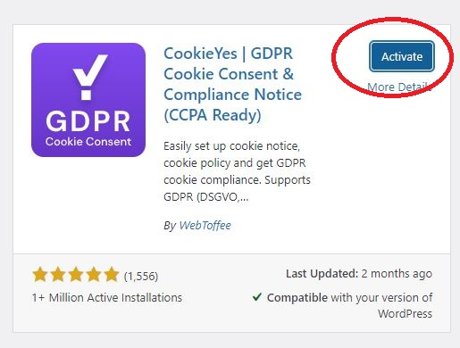
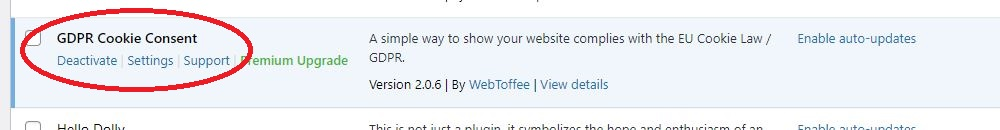

### 1. Find the plugin tab in wordpress

The plugin tab is able to find in the menu bar from left hand side.
Scroll down and you will able to find the plugin tab.

### 2. Go to the plugin adding page

Put your mouse cursor on the plugin tab and click 'Add new'. 

#### 3. Search 'CookieYes' plugin in the search bar

#### 4. Install the plugin

Make sure you find the 'CookieYes' plugin as the below image. And click 'Install Now'

#### 5. Activate the plugin 

After you installed the plugin, to have to click the 'Activate' button to enable the 'CookieYes' plugin to your wordpress site.

#### 6. Final check

When you finished activation, you will be redirected to the plugins page. You can take a look on the plugins list and you should able to see the name of 'GDPR Cookie Consent' plugin. 

