### We will briefly introduce some features of the 'CookiesYes' 
 

#### CookieYes 

After you follow our last step, you should able to see the dashboard of the 'CookieYes' plugin by clicking the GDPR Cookie Consent tab.

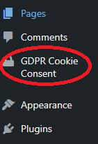

Dashboard tabs include:
1. General: Allow admin to enable cookie bar and select the type of law. Since we wneed to follow the GDPR compliance. Therefore, we'll choose GDPR instead another two.
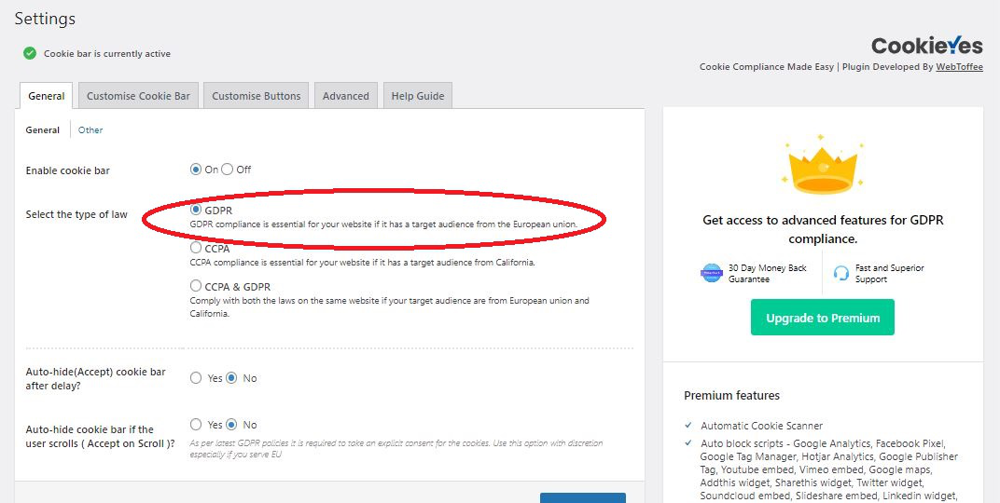
2. Customise Cookie Bar: You can customise your cookie bar by changing message heading or bar colours here.
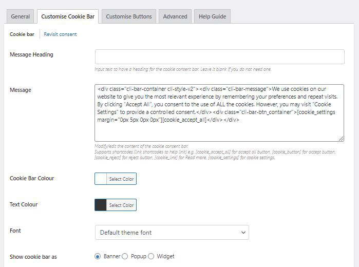
3. Customise Buttons: Allow you to customise the button colours and styles.
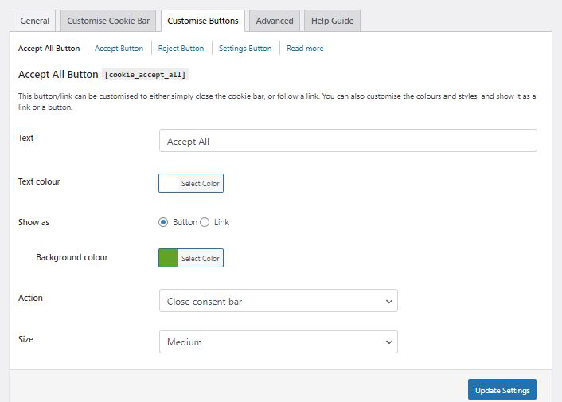
4. Advanced: Allow admin to reset the cookie bar configuration to default setting.
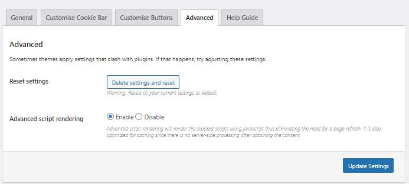
5. Help Guide:  Includes shortcodes and help links.
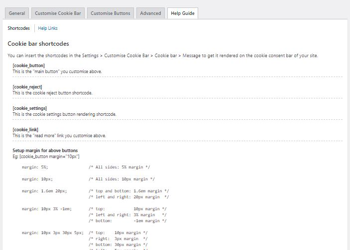

### Cookie list
It will list cookies' types, name and category for chekcing
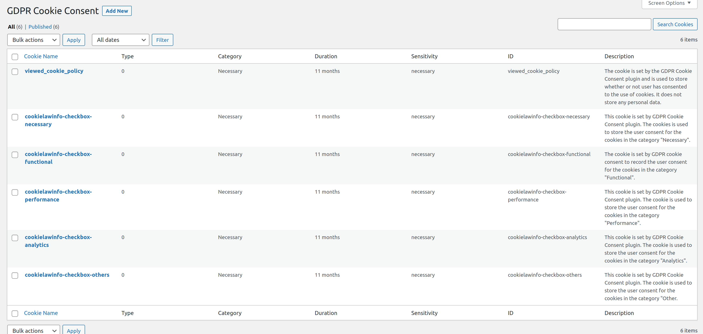

### Cookie category
Allow to add cookies category by seetting name, slug desciption and head or body script.
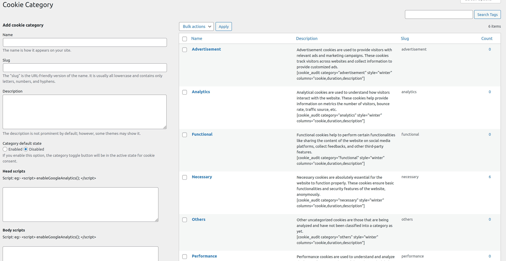

### Cookie scanner
Allow to scan all cookies in your site. 
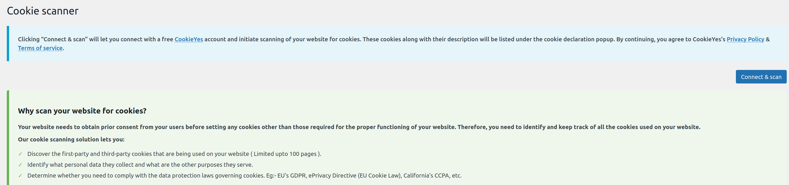

### Policy generator
Generate policy for site user to understand how we use the cookies.
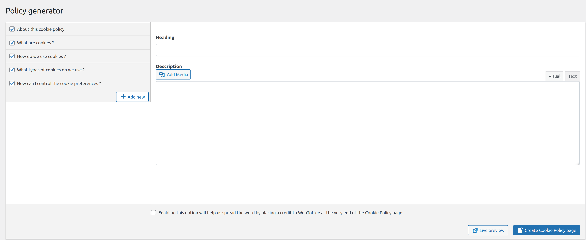

### Script blocking
Blocking script such as Facebook Pixel.
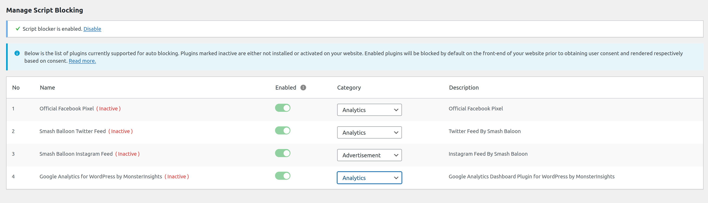

### Privacy overview
Allow admin to preview and edit the privacy overview
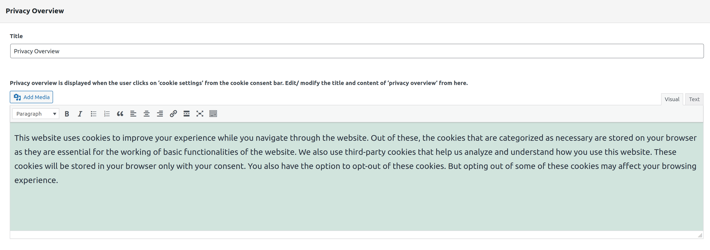

