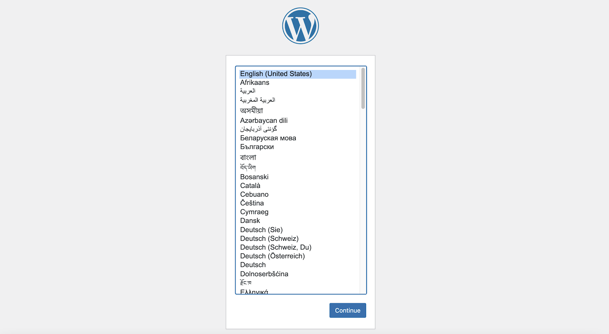
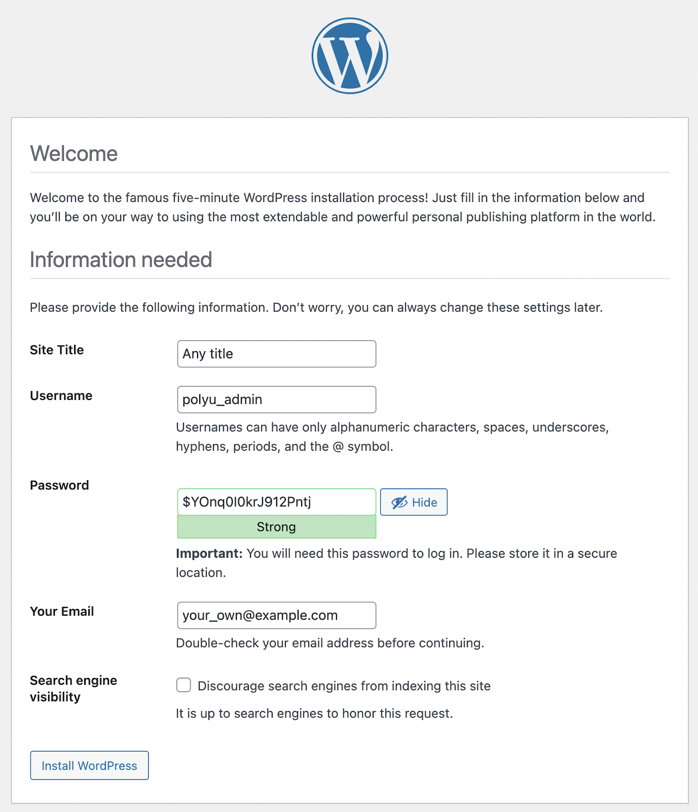
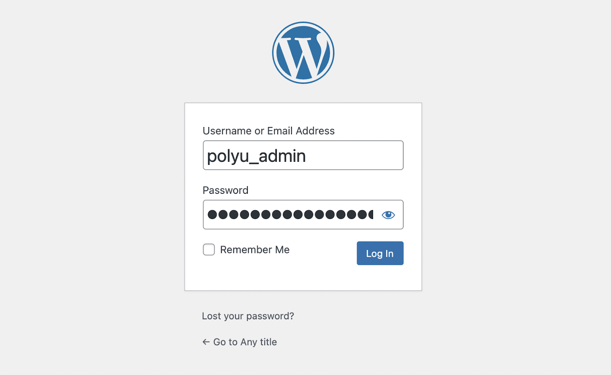
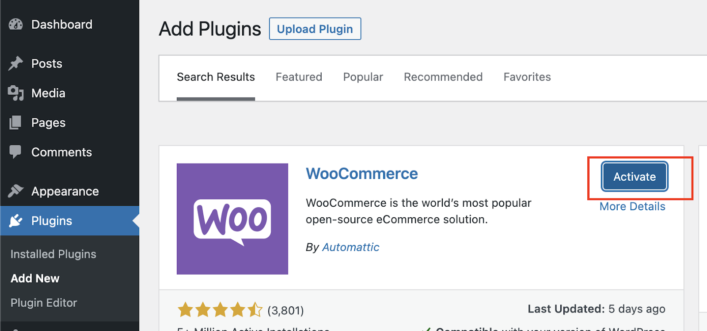
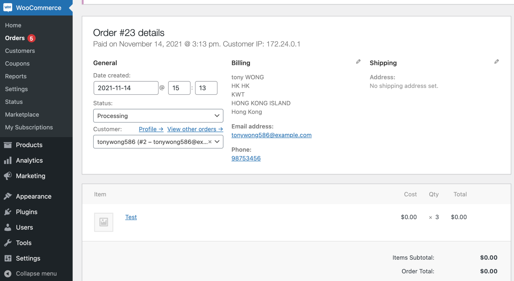
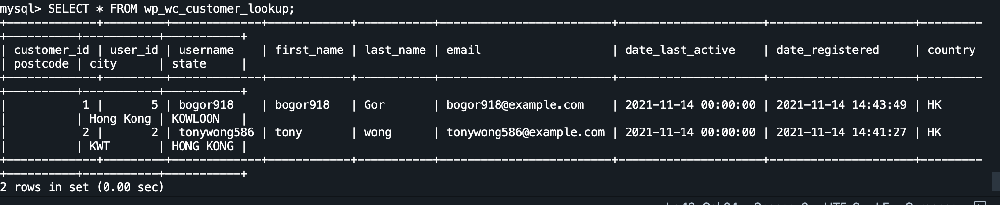

 

#### 1. Select your preferred WordPress language (English)

#### 2. Enter the information needed by the WordPress (Site title, username, password and email)

Username and password can use the following:

Username: polyu_admin

(Use your own username during your OWN setup)

Password: $YOnq0I0krJ912Pntj

(Use the generated password during your OWN set up, it creates strong and unpredictable passwords for your admin account)

 

#### 3. Click "Install WordPress" to continue

 

#### 4. Click "Login" to continue

 

#### 5. Fill in the login credentials that we set up in step 2 and login into the dashboard

Username: polyu_admin

Password: $YOnq0I0krJ912Pntj

 

#### 6.Setup WooCommerce

 

#### 7. Search Personal Personally identifiable information (PII) 

On the WooCommerce order page, it is available to search order information from the customer.The order information: address,email,name,phone number.

 

#### 8. Search PII in MySQL

 

##### Login to MySQL

`docker exec -it mysql -u root -p`{{execute}}

 

##### Select customer data

`use wordpress SELECT * FROM wp_wc_customer_lookup;`{{execute}}

 

##### Check the result

