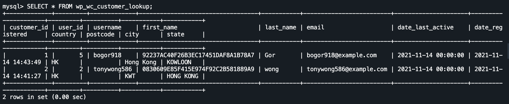

 

### Encrypt important data

 

To encrypt important data like name, you may use this command to encrypt it:

`UPDATE wp_wc_customer_lookup SET first_name=HEX(AES_ENCRYPT(first_name, '1234'));`{{execute}}

The other column of the data also can use the above command to encrypt like ID or password.

