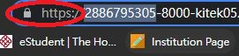

# Well done!!!

You just learnt what is SSL and how to apply SSL to your own wordpress site.
 
Remember to check if the SSL installation is successful.
 

Succesful SSL implement will show a lock with HTTPS.
 