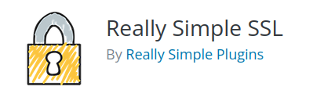

## Intro to SSL

SSL, or Secure Sockets Layer, is an encryption-based Internet security protocol. It was first developed by Netscape in 1995 for the purpose of ensuring privacy, authentication, and data integrity in Internet communications. SSL is the predecessor to the modern TLS encryption used today and it can be checked by looking if it is HTTPS instead of HTTP. 

SSL will encrypt any data to an unreadable string such as below graph. And those characters are nearly impossible to decrypt.

Therefore, in this scenario we are trying to use 'Really Simple SSL' to improve the security of the wordpress site.

