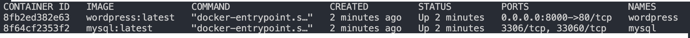

 

## Step 1:
#### 1. Setup your Wordpress and WooCommerce stack

Docker Compose is based on a docker-compose.yml file. This file defines all of the containers and settings you need to launch your set of clusters.

<pre class="file" data-filename="./docker-compose.yml" data-target="replace">
version: "3.2"

services:
  mysql:
    container_name: mysql
    image: mysql:latest
    volumes:
      - ./db_data:/var/lib/mysql
    restart: always
    environment:
      MYSQL_ROOT_PASSWORD: d2Oqadruj9*
      MYSQL_DATABASE: wordpress
      MYSQL_USER: wordpress
      MYSQL_PASSWORD: d2Oqadruj9*

  wordpress:
    container_name: wordpress
    depends_on:
      - mysql
    image: wordpress:latest
    volumes:
      - ./wordpress_data:/var/www/html
    ports:
      - "8000:80"
    restart: always
    environment:
      WORDPRESS_DB_HOST: mysql:3306
      WORDPRESS_DB_USER: wordpress
      WORDPRESS_DB_PASSWORD: d2Oqadruj9*
      WORDPRESS_DB_NAME: wordpress

volumes:
  db_data: {}
  wordpress_data: {}
</pre>

#### 2. Start the WordPress and MySql container in background

Run `docker-compose up -d`{{execute}}

#### 3. Check if both container is running

Run `docker ps`{{execute}}
 

#### 4. Check the logs of the both container to make sure there is no errors

Run `docker logs mysql`{{execute}}

Run `docker logs wordpress`{{execute}}

#### 5. Access your WordPress application at localhost:8000

You can access you WordPress in katacoda through https://[[HOST_SUBDOMAIN]]-8000-[[KATACODA_HOST]].environments.katacoda.com or click on the "WordPress" tab
