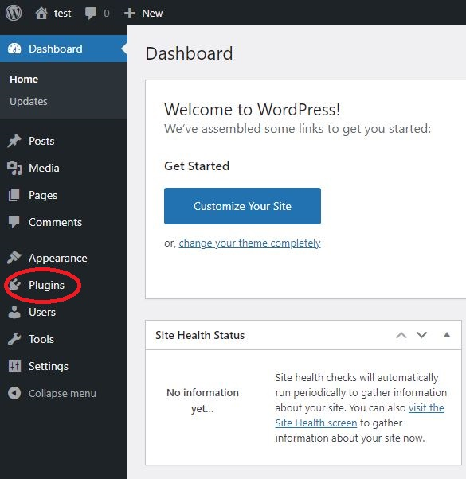

## Step 3:

### 1. Find the plugin tab in wordpress

The plugin tab is able to find in the menu bar from left hand side.
Scroll down and you will able to find the plugin tab.

### 2. Go to the plugin adding page

Put your mouse cursor on the plugin tab and click 'Add new'. 

#### 3. Search 'Really Simple SSL' plugin in the search bar

#### 4. Install the plugin

Make sure you find the 'Really Simple SSL' plugin as the below image. And click 'install now'

