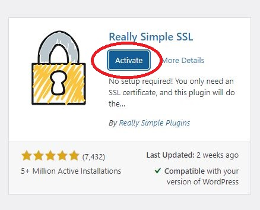
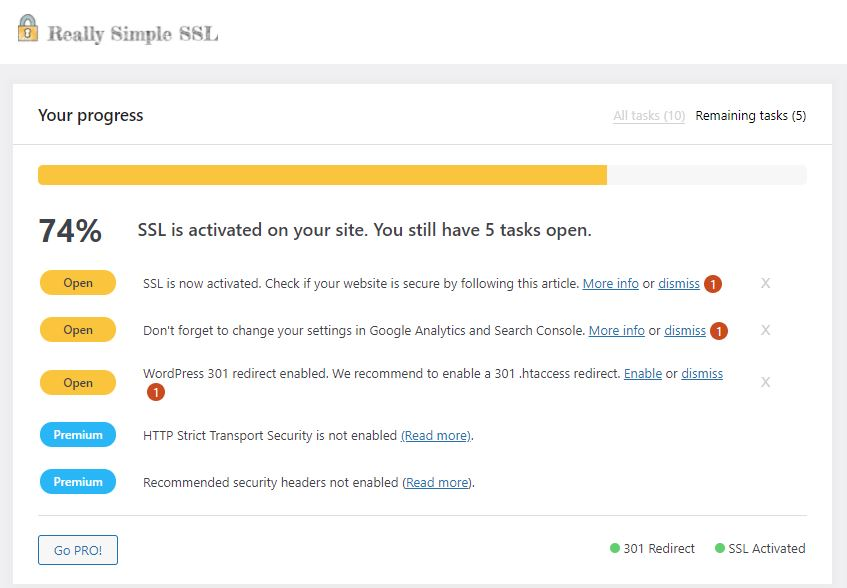

### 1. Activate the plugin

After install the plugin, you can activate the plugin by clicking 'Activate' button.

### 2. Activate the SSL 

After activate the 'Really Simple SSL', you can check out if the plugin is successfully in wordpress. Click 'Acticate SSL' you can see the progress widget in Settings > SSL . 

### 3. Check out you progress

Congratulations, the SSL plugin should working fine when you have come to this step. The last thing you need to do is just follow the instruction and tasks in the SSL progress widget.

In this case, it told us to enable the '301 .htaccess redirect' which can control the protocol by changing HTTP to HTTPS. So we need move to the next widget to enable the redirection.

