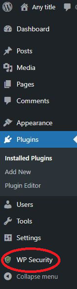

### 1. Find the plugin tab in wordpress

The plugin tab is able to find in the menu bar from left hand side.
Scroll down and you will able to find the plugin tab.

### 2. Go to the plugin adding page

Put your mouse cursor on the plugin tab and click 'Add new'. 

#### 3. Search 'All In One WP Security & Firewall' plugin in the search bar

#### 4. Install the plugin

Make sure you find the 'All In One WP Security & Firewall' plugin as the below image. And click 'Install Now'

#### 5. Activate the plugin 

After you installed the plugin, to have to click the 'Activate' button to enable the firewall plugin to your wordpress site.

#### 6. Final check

When you finished activation, you will be redirected to the plugins page. You can take a look on the plugin list and you should able to see the name of 'All In One WP Security' plugin and it also appears in the bottom of the menu bar. Click it and you can proceed to the next step.

