## Plugin introduction
### We will briefly introduce some features of the 'All In One WP Security & Firewall' 
 

#### 1. Firewall - dashboard

After you follow our last step, you should able to see the dashboard of the firewall plugin. You can see there are multipe widgets and tabs.

Dashboard tabs include:
1. Dashboard: Show widgets like 'Security Strength Meter' and 'Critical features status'. Since nothing is setup yet, the meter will be zero and all features status are off. (You can follow the plugin instruction to increase the strength level)
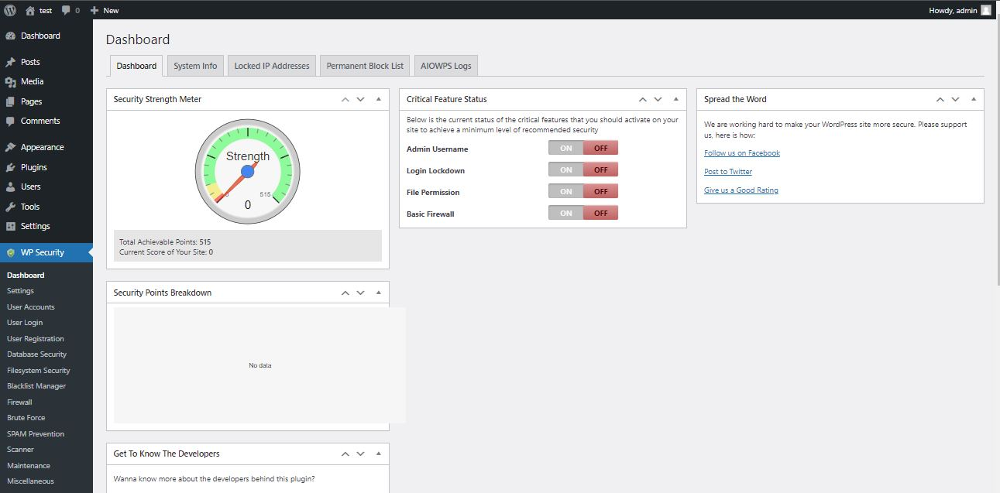
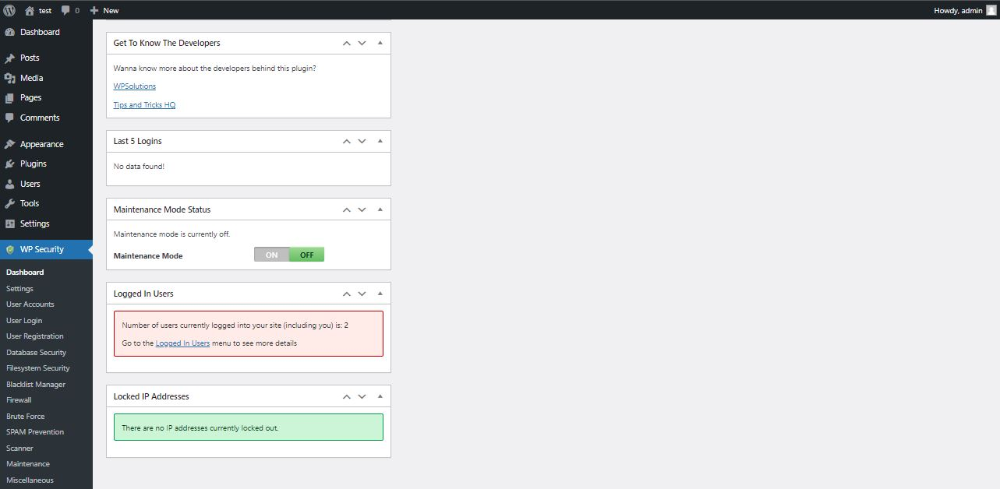
2. System info: Show site info like Wordpress version and mysql version. And it can also show PHO info and all plugins in wordpress. 
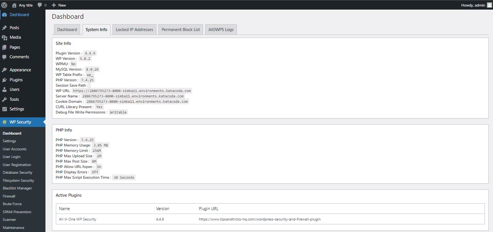
3. Locked IP address: Display locked IP which is due to the lockdown features.
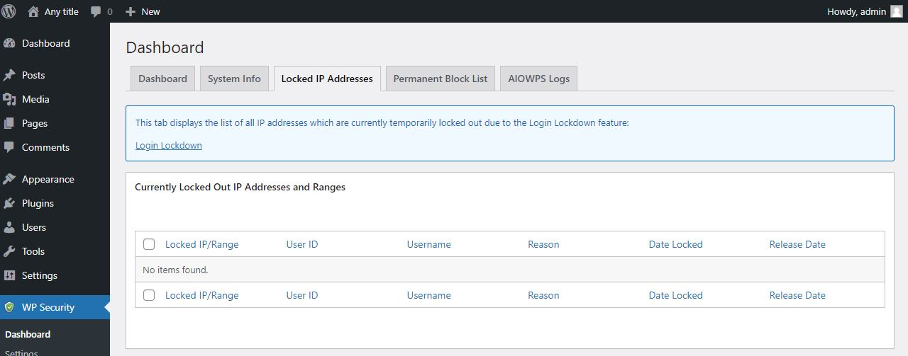
4. Permanent Block List: Dispplay all permanently blocked IP addresses.
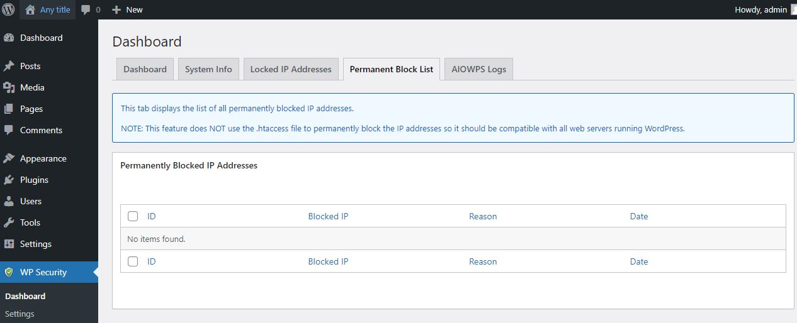
5. AIOWPS Logs: View logs for this plugin. 
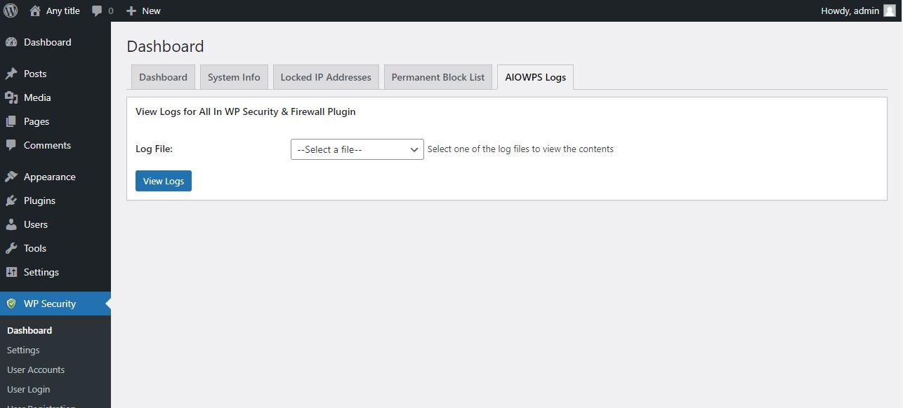

#### 2. Firewall - User login

User login allow administrator to check any user login and login failure in wordpress. Click the 'User Login' button below the WP Security tab.

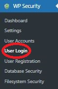

After that, you will able to see 5 tabs in User Login

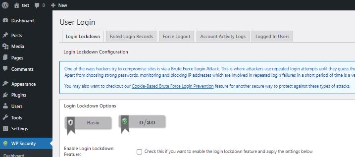

User Login tabs include:
 

1. Login Lockdown: Function to lock the account which retry time equal to the maximum attempt. And you can also whitelist a user to prevent its account being locked down.

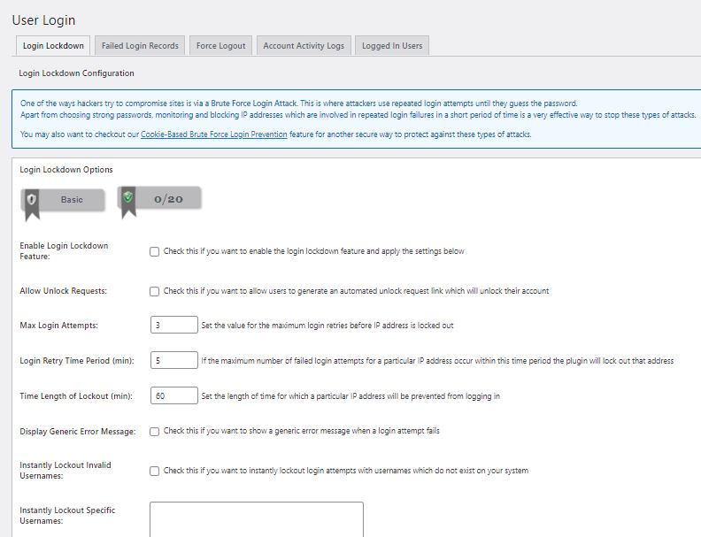
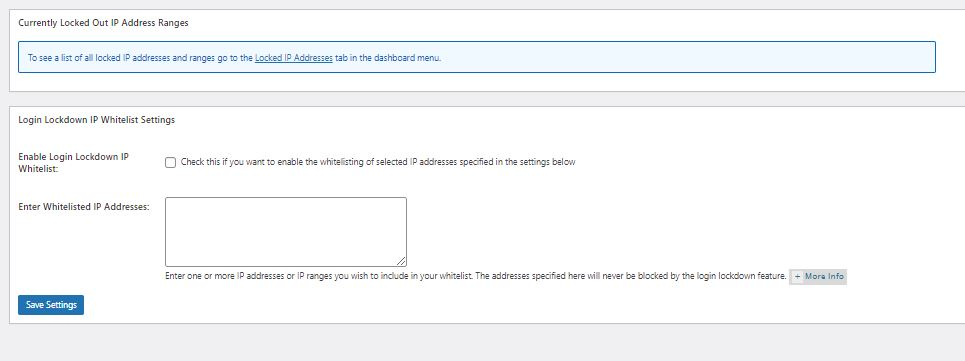

2.  Failed Login Records: Function to display the failed login attempts for your site. 

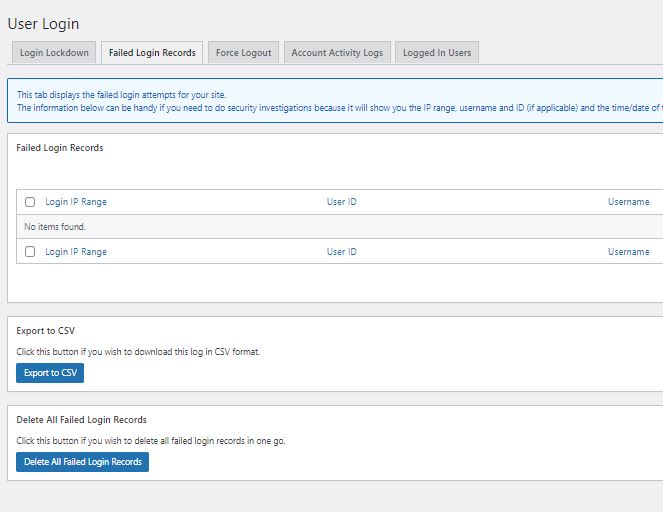

3. Force Logout: Enable this function can enforce a user account to logout after it reached the time limit. You can modify the logout time besides using default logout time (60 minutes). 

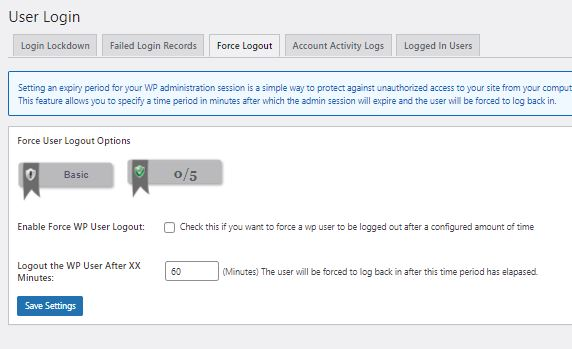

4.  Account Activity Logs: Used to display the account activities when they logged in to wordpress.

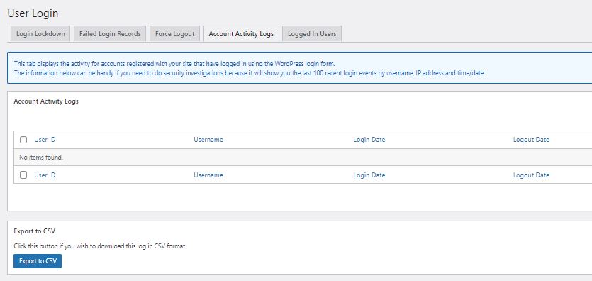

5.  Logged In Users: This tab displays all users who are currently logged into your site. You should able to check you are logged in as admin and your IP address.

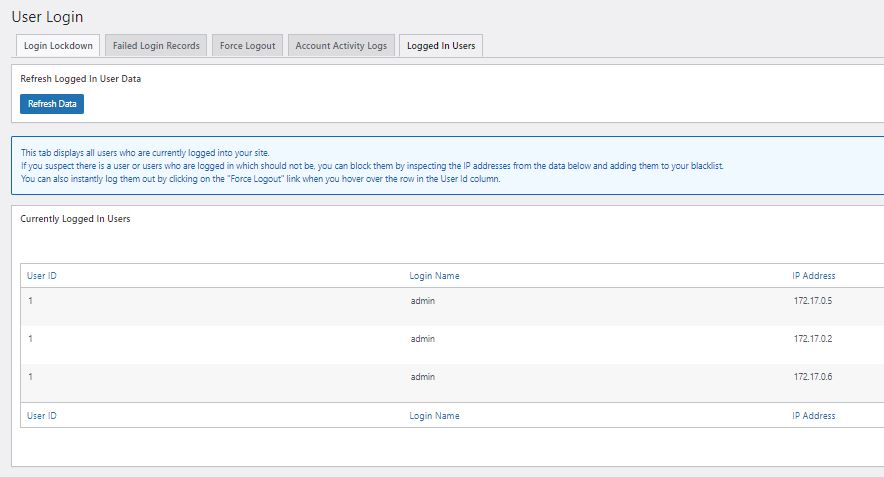

#### 3. Firewall - Firewall 

Firewall is one of the most important function in this plugin. You can access by clicking firewall button in  WP Security tab.

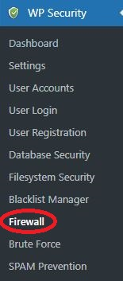

And you can find 6 tabs in firewall function.

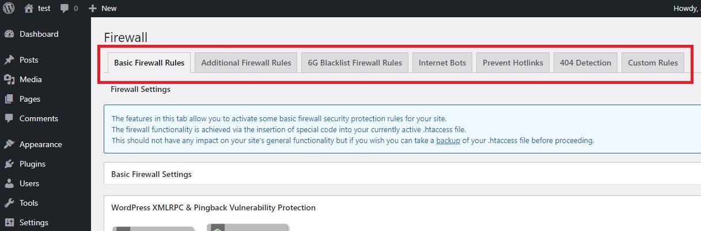

Firewall tabs include:

1. Basic Firewall Rules: Enable the firewall rules to increase the wordpress security by some simple rules such as Disable the server signature, Limit file upload size and deny access to wp-config.php file. 

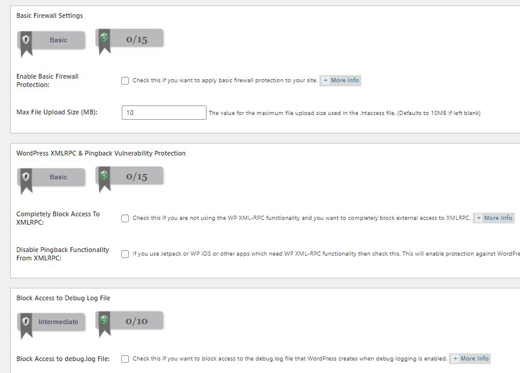

2. Additional Firewall Rules: Can increase the site security by insert some special code.

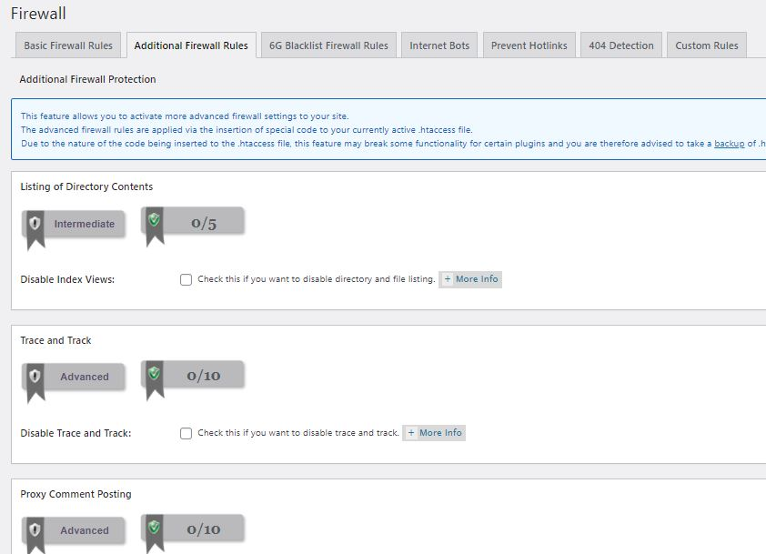
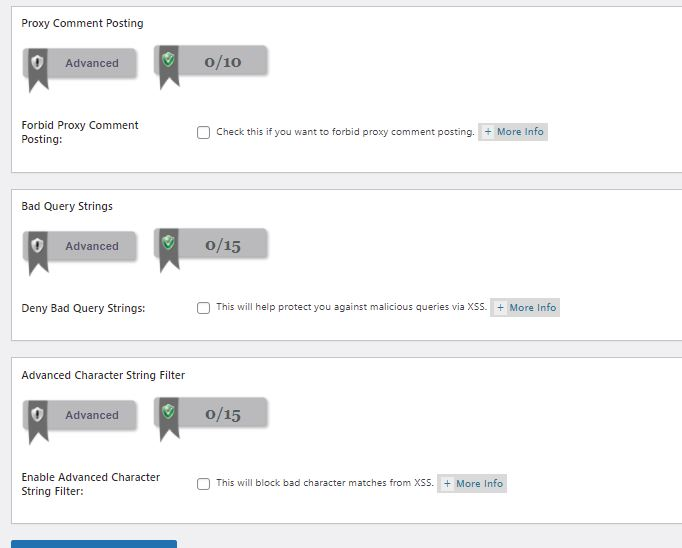

3. 6G Blacklist Firewall Rules: Defend the wordpress site from malicious URI requests, bad bots or spam.

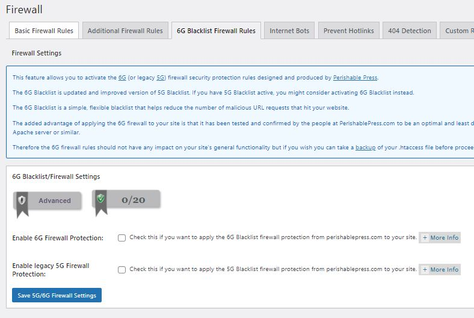

4. Internet Bots: Secure your wordpress site by block all bots which use the "Googlebot"

5. Prevent Hotlinks: Secure your wordpress site by prevent people from directly hotlinking images from your site's pages by writing some directives in your .htaccess file.

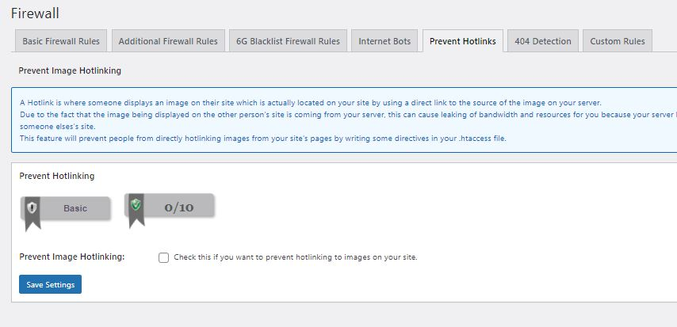

6. 404 Detection: Prevent attacker to find a particular page or URL for sinister reasons

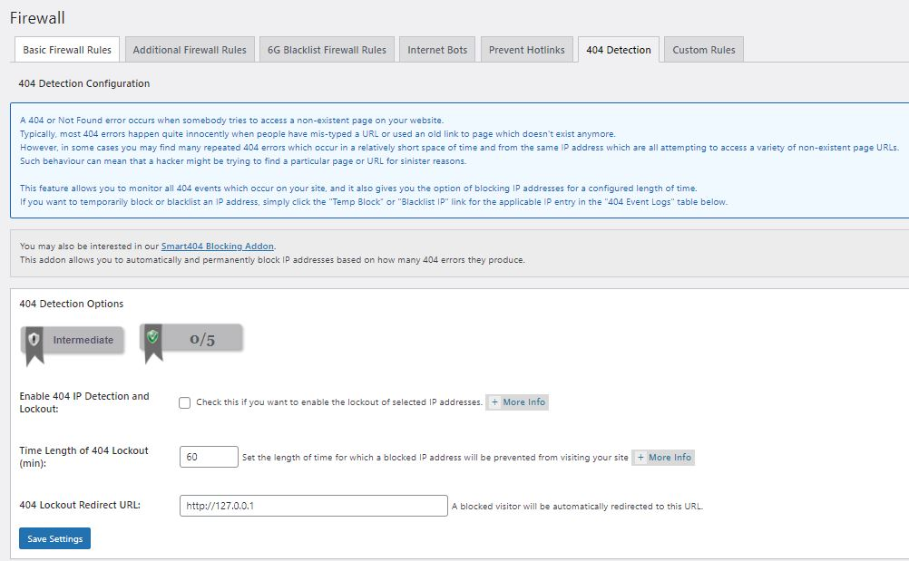

7. Custom Rules: Allow admin to apply your own custom .htaccess rules and directives.

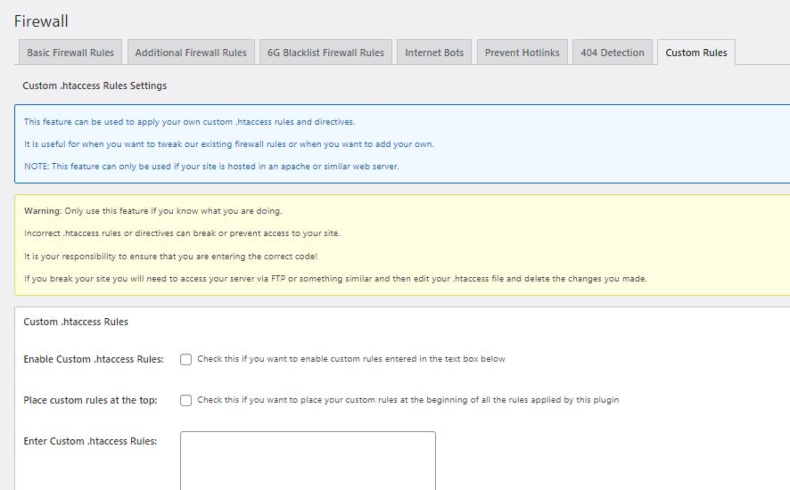