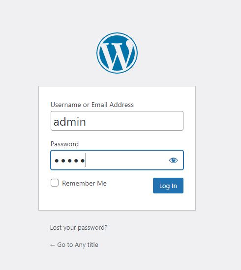

 
#### 1. Select your preferred wordpress language (English)

#### 2. Enter the information needed by the WordPress (Site title, username, password and email)

Username and password can use the followings: 

Username: `admin`{{copy}}
 

Password: `admin`{{copy}}
 
(Create a simple password for later use)
 

#### 3. Click "Install WordPress" to continue

#### 4. Click "Login" to continue

#### 5. Fill in the login credentials that we set up in step 2 and login in to the dashboard

Username: `admin`{{copy}}
 
Password: `admin`{{copy}}
 

