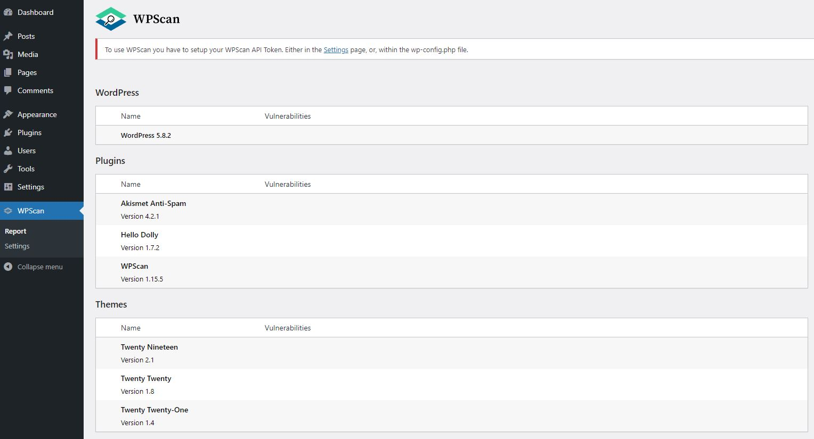
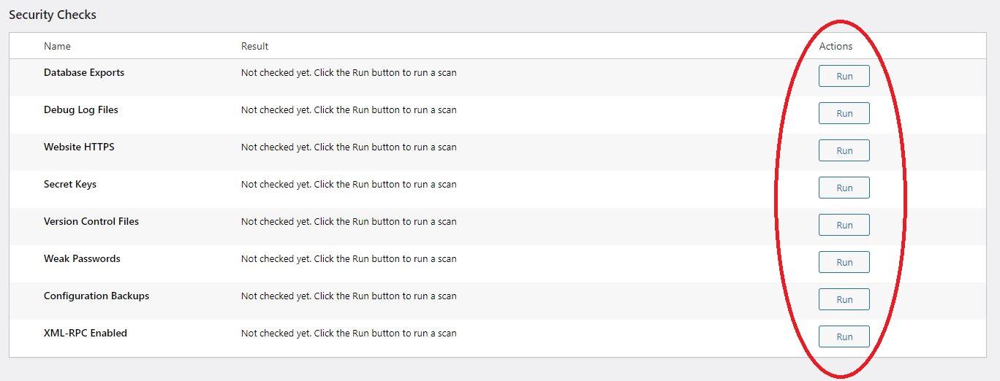
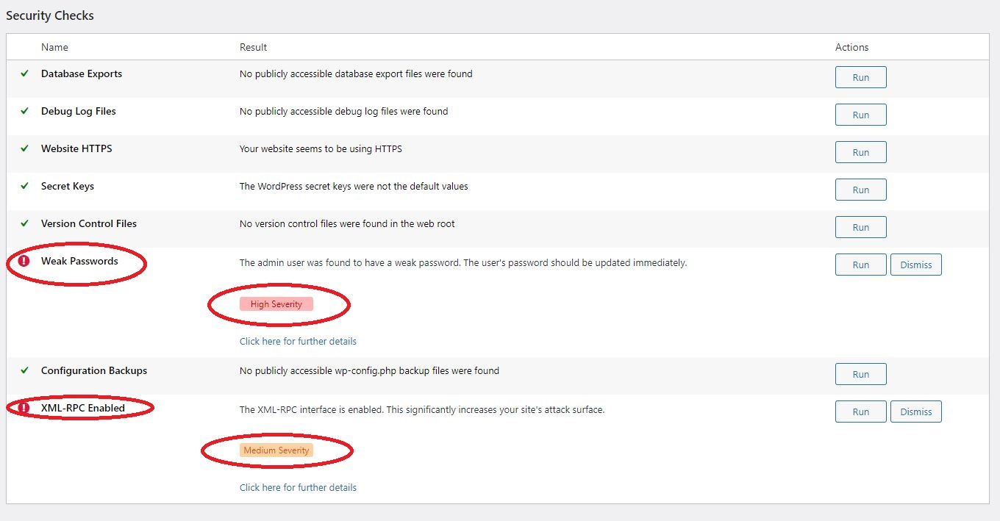

### 1. WPScan features

Congratulations, the 'WPScan' plugin should working fine when you have come to this step. Inside the WPScan page, you can see the following features.

* Wordpress version
* Plugin details
* Theme detail
* Security check

### 2. Start the security checking  

When you scroll down to the 'Security Checks', you can see there are multiples type of checking that can be perform. Click 'Run' to all choices and perform a full scan.

### 3. Checking the scanning report

When the full scanning is done. You should be alerted by the 'Weak Password' and 'XML-RPC Enabled'.

* Weak password: Since the account and passsword is so weak (user:admin password:admin)
* XML-RPC Enabled: A cross-platform communication protocol that common to hack

